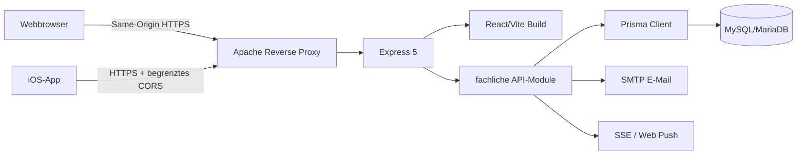
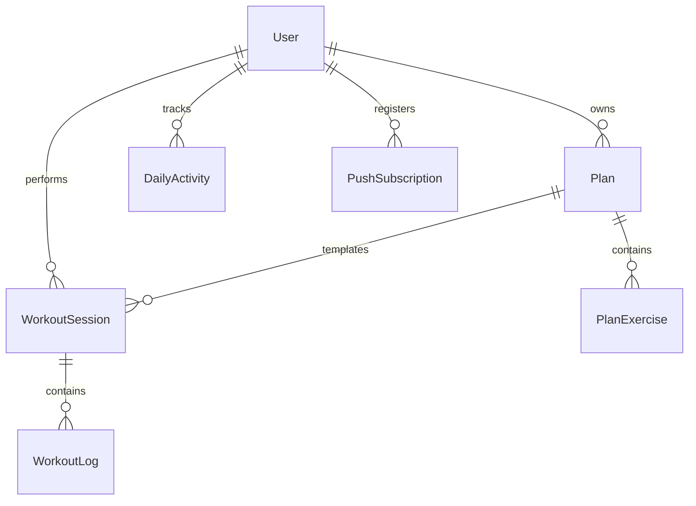

# NEXT REPS – Architekturdokumentation

**Projektteam:** Isabel Prieb und Marcel Miller

**Produkt:** NEXT REPS

**Web:** [next-reps.de](https://next-reps.de)

## 1. Ziel und aktueller Stand

NEXT REPS ist eine mobile-first Fitness-Anwendung für Workout-Planung,
Trainingstracking, tägliche Aktivität, Hydration und Fortschrittsanalyse. Die
Anwendung läuft als Website unter [next-reps.de](https://next-reps.de) und wird
mit Capacitor zusätzlich als iOS-App ausgeliefert.

### Ausgangsproblem und Produktidee

Die Idee zu NEXT REPS entstand aus einem konkreten Problem im Fitnessalltag:
Viele Trainierende finden keine Anwendung, die Trainingsplanung,
Satz- und Wiederholungstracking sowie eine verständliche Auswertung in einem
durchgängigen Ablauf verbindet. Stattdessen werden Trainingsdaten häufig über
Excel-Tabellen, lose Notizen auf dem Smartphone oder ein klassisches Notizbuch
geführt. Diese Lösungen funktionieren grundsätzlich, erzeugen aber Reibung:
Daten sind verstreut, Fortschritte schwer erkennbar und die Planung des
nächsten Trainings bleibt weitgehend manuell.

NEXT REPS bündelt diesen Ablauf in einem Produkt. Nutzer können individuelle
Trainingspläne anlegen, Übungen mit Sätzen und Wiederholungen dokumentieren,
Trainingseinheiten durchführen und ihre Entwicklung anschließend in
Auswertungen nachvollziehen. Die Anwendung ersetzt damit nicht nur die
Excel-Tabelle oder das Trainingsbuch, sondern schafft einen geschlossenen
Kreislauf aus **Planen, Trainieren, Erfassen und Analysieren**.

### Entwicklung vom Webprodukt zur mobilen Fitnessplattform

Die Lösung wurde bewusst schrittweise entwickelt:

1. Zunächst entstand eine Webanwendung, um die Kernidee schnell nutzbar und
   plattformunabhängig zu validieren.
2. Danach kamen Fortschrittsanalysen, Tagesaktivität, Hydration und eine aktive
   Trainingsplanung hinzu.
3. Der React-Client wurde anschließend mit Capacitor als iOS-App umgesetzt.
4. Die mobile Anwendung wurde mit Apple Health beziehungsweise der Apple Watch
   verbunden, damit relevante Aktivitätsdaten in den persönlichen
   Trainingskontext einfließen können.

Diese Entwicklung erklärt auch die gewählte Architektur: React/Vite ermöglicht
eine gemeinsame Produktoberfläche für Web und iOS, während das zentrale
Express-Backend Pläne, Sessions und Analysen für beide Clients bereitstellt.
Web- und Mobilprodukt sind dadurch keine getrennten Prototypen, sondern zwei
Zugänge zum selben System.

### Branding, Vermarktung und Produktziel

NEXT REPS besitzt eine vollständig eigenständig entwickelte visuelle
Identität. Branding, Grafikdesign und Logo wurden nicht aus einer vorhandenen
Vorlage übernommen, sondern in einem vollständigen Designprozess erarbeitet.

Am Anfang stand die visuelle und strategische Recherche. Auf Miro wurde ein
Moodboard aufgebaut, das unterschiedliche Richtungen für Sport, Energie,
Fortschritt, Technologie, Typografie und Farbstimmung zusammenführte. Das
Moodboard diente nicht als Sammlung beliebiger schöner Bilder, sondern als
Entscheidungsgrundlage: Welche Stimmung soll die Marke vermitteln, wie
unterscheidet sie sich von klassischen Fitnessstudios und welche Elemente
lassen sich über App, Website und Social Media hinweg konsistent einsetzen?

Auf dieser Basis entstanden Logoentwürfe zunächst als Handskizzen. Dabei wurde
untersucht, wie sich Buchstaben, Name und Produktaussage konzeptionell
miteinander verbinden lassen. Ein zentrales Motiv wurden Pfeile: Sie stehen
für Tracking, Richtung, Wiederholung, Entwicklung und den nächsten
Trainingsfortschritt. Mehrere formale und typografische Varianten wurden
verglichen, reduziert und weiterentwickelt, bis das heutige Zeichen und die
Wortmarke entstanden.

Die ausgewählten Entwürfe wurden anschließend in Adobe Illustrator als
präzise Vektorgrafiken umgesetzt. Dort wurden Proportionen, Abstände,
Linienführung und unterschiedliche Logoanwendungen ausgearbeitet. Die
finalisierten Dateien wurden in geeigneten Formaten exportiert und in Website,
iOS-App, Landingpage und weitere Markenmedien integriert. Dadurch bleibt das
Logo von kleinen App-Icons bis zu großen Key Visuals konsistent und
skalierbar.

Zur Brand Identity gehören neben dem Logo:

- Lime-Grün und Dark Mode als wiedererkennbare Farbwelt,
- Pfeile und gerichtete Formen als visuelles System für Fortschritt,
- eine kraftvolle, reduzierte Typografie,
- eigene Key Visuals und Bildstimmungen,
- Bewegungsprinzipien für Reels, Übergänge und Interface-Animationen,
- wiederkehrende Logo- und Sublogo-Anwendungen.

Das Branding wurde bewusst auch außerhalb des eigentlichen Interfaces
angewendet. Für Instagram und weitere Social-Media-Formate entstanden Posts,
Reels, Schnitte und Stimmungsvorgaben. Dadurch konnte geprüft werden, ob die
Identität nicht nur innerhalb eines App-Screens funktioniert, sondern als
erkennbare Marke kommunizierbar ist. Insbesondere die Kombination aus
dunkler Bildwelt, Lime-Akzenten, dynamischer Typografie und Bewegung zeigt,
wohin NEXT REPS als Produkt und Marke langfristig führen soll.

Die Social-Media-Arbeit erfüllt damit mehrere Funktionen: Sie macht die Marke
früh sichtbar, gibt potenziellen Nutzern einen emotionalen Zugang zum Produkt,
schafft einen zukünftigen Feedbackkanal und erprobt bereits vor dem Launch
eine konsistente Vermarktung. Branding und Marketing wurden folglich nicht
erst als spätere Dekoration betrachtet, sondern als Teil der Produktstrategie.

Das Ziel endet nicht mit der Prüfungsabgabe. Die App soll in naher Zukunft
veröffentlicht, vertrieben und mit realen Nutzern aktiv getestet werden. Dabei
sollen Nutzungsfeedback, technische Stabilität und die Verständlichkeit der
Analysen systematisch überprüft werden. Die aktuelle Anwendung bildet dafür
einen funktionsfähigen Produktkern.

### Produkt-Roadmap

Die folgenden Funktionen sind als nächste Ausbaustufen geplant und werden klar
vom bereits implementierten Umfang getrennt:

| Ausbaustufe | Geplanter Nutzen |
| --- | --- |
| Pläne teilen | Trainingspläne zwischen Nutzern freigeben sowie als PDF exportieren oder versenden |
| Trainer-Funktion | Trainer erstellen Pläne, weisen sie Sportlern zu und werten deren Durchführung und Entwicklung aus |
| KI-gestütztes Coaching | Auf Basis vorhandener Trainings- und Analysedaten Pläne vorschlagen, Entwicklungen erklären und individualisierte Hinweise geben |
| Geführte Produkttour | Neue Nutzer nach der Registrierung kontextbezogen durch zentrale Bereiche und Bedienabläufe führen |
| Update-Hinweise | Nach größeren Releases neue Funktionen kompakt erklären und direkt zur passenden Stelle führen |
| Öffentlicher Produktstart | App veröffentlichen, aktiv vermarkten und anhand realer Nutzung iterativ verbessern |

Für die KI-Funktionen gilt bewusst: Empfehlungen sollen nachvollziehbar bleiben
und vorhandene Daten nutzen, ohne medizinische Diagnosen oder professionelle
Betreuung vorzutäuschen. Vor einer Umsetzung müssen deshalb Datenschutz,
Einwilligung, Datenqualität und transparente Grenzen der Empfehlungen
architektonisch berücksichtigt werden.

Dieses Dokument ist die zentrale Dokumentation des Abgabestands. Es verbindet
die aktuelle Systemarchitektur mit den Entscheidungen aus den Studio-Sessions,
begründet verworfene Alternativen und reflektiert, was im Nachhinein anders
umgesetzt würde. Die lange README unter `workout-tracker/frontend/README.md`
bleibt als historisches Arbeitsprotokoll erhalten.

## 2. Lauffähige Anwendung

### One-Command-Start

Voraussetzungen sind Node.js 22, npm und Docker mit Docker Compose.

```bash
npm ci
npm start
```

`npm start` startet MySQL, wartet auf den Healthcheck, generiert den Prisma
Client, wendet Migrationen an und startet Backend sowie Frontend. Danach sind
Frontend und API unter `http://localhost:5173` beziehungsweise
`http://localhost:3000/api` erreichbar.

### Konfiguration

Alle lokal benötigten Werte stehen in:

- `workout-tracker/backend/.env.example`
- `workout-tracker/frontend/.env.example`

Beim ersten Start wird die lokale Backend-Konfiguration automatisch aus der
Beispieldatei erzeugt. Produktive Datenbank-, SMTP-, JWT-, VAPID- und
SSH-Secrets liegen nicht im Repository. Das GitHub-Deployment verwendet die
Secrets `HETZNER_SSH_HOST`, `HETZNER_SSH_USER` und `HETZNER_SSH_KEY`.

## 3. Aktuelle Systemarchitektur

NEXT REPS ist ein modularer Monolith. Eine Express-Anwendung stellt die API
bereit und liefert in Produktion gleichzeitig den React-Build aus. Prisma
kapselt MySQL/MariaDB. Derselbe React-Client wird mit Capacitor als iOS-App
verpackt.



### Frontend

React 19, React Router und Vite bilden die Oberfläche. `App.jsx` steuert den
Zugriff abhängig von Login, E-Mail-Verifikation und abgeschlossenem
Onboarding. `src/api.js` kapselt alle Requests. Die Website verwendet `/api`
same-origin und authentifiziert sich mit einem HttpOnly-Cookie. Die iOS-App
verwendet die produktive HTTPS-API und einen Bearer-Token.

### Backend-Module

| Kontext | Verantwortung | API |
| --- | --- | --- |
| Identity & Access | Registrierung, Login, Verifikation, Onboarding, Profil | `/api/auth` |
| Training | Pläne, Übungen, Sessions, Satz-Logs | `/api/plans`, `/api/workouts`, `/api/sessions` |
| Daily Activity | Wasser, Schritte und Tagesaktivität | `/api/daily-activity` |
| Insights & Coaching | Statistiken, Progress und Coach-Auswertung | `/api/stats`, `/api/progress`, `/api/coach` |
| Notifications | Push-Subscriptions und Benachrichtigungen | `/api/push`, `/api/events` |

`server.js` ist der Composition Root. Die Plan-Schreiblogik liegt bereits in
`training.service.js`. Weitere Service-Dateien markieren die gewünschte
Modulgrenze, enthalten aber teilweise noch nicht die gesamte Geschäftslogik.
Route-Dateien wie Identity, Sessions und Coach bleiben deshalb dokumentierte
Refactoring-Ziele.

### Datenmodell



MySQL speichert Nutzer, Pläne, Übungen, Sessions, Satz-Logs, Tagesaktivitäten
und Push-Subscriptions. `clientSessionId` macht Session-Speicherung
idempotent. Prisma-Migrationen versionieren alle Schemaänderungen.

### Authentifizierung und Sicherheit

Passwörter werden mit bcrypt gehasht. Nach erfolgreichem Login wird ein
signierter JWT ausgegeben. Webclients erhalten ihn als HttpOnly-, Secure- und
SameSite-Cookie; native Clients verwenden den Bearer-Header. Geschützte Queries
filtern zusätzlich nach der serverseitig ermittelten `userId`.

Weitere Schutzschichten:

- CSRF-Header für zustandsändernde Requests
- Auth-, Login-, Mail- und Verification-Rate-Limits
- gehashte, ablaufende und versuchslimitierte Verifikationscodes
- explizite Feld-Allowlist bei Profiländerungen
- begrenzte JSON- und Bildgrößen
- Helmet, CSP und explizit vertrauenswürdige Reverse Proxies

### Security-Review: CodeSniper V1 bis V9

Die Sicherheitsarbeit wurde nicht nur punktuell, sondern durch wiederholte
CodeSniper-Scans überprüft. Der erste Bericht V1
(`18ab13e3-d5ac-4696-a1ba-ccb149f44790`) bewertete den Stand mit 33
Code-Findings und 41 Dependency-Findings als schwach. Darunter waren fünf
High-Findings, unter anderem fehlendes Rate-Limiting, hart codierte
Zugangsdaten, unsichere Build-Abhängigkeiten und unzureichende serverseitige
Autorisierung.

Der abschließende Vergleichsbericht V9
(`9bf55ff9-f95f-4193-be9c-468c459096c0`) enthält noch fünf Code-Hinweise und
zwölf Dependency-Hinweise. Das entspricht einer Reduktion um 28 Code-Findings
und 29 Dependency-Findings. V9 bestätigt außerdem, dass keine aktiven
Produktionszugangsdaten, API-Keys oder privaten Schlüssel im Repository
gefunden wurden.

Wichtige Maßnahmen zwischen den Scans:

- serverseitige Ownership-Prüfungen und Demo-Account-Schutz
- getrennte Rate-Limits für Login, Verifikation und E-Mail-Versand
- Ablaufzeit, Versuchslimit und serverseitige Speicherung von
  Verifikationscodes
- CSRF-Headerprüfung, Helmet/CSP und sichere Redirect-Validierung
- Größenlimits für JSON und Profilbilder
- SSH-Key statt Passwort im Deployment
- gezielte Dependency-Upgrades und Overrides

Die verbliebenen V9-Hinweise werden differenziert bewertet:

- Der Medium-Hinweis zum schnellen SHA-256-Hash eines niedrig-entropischen
  sechsstelligen Codes ist ein berechtigtes Rest-Risiko. Ablaufzeit,
  Versuchslimit und Rate-Limiting begrenzen Online-Angriffe; für besseren
  Schutz bei einem Datenbankabfluss soll auf einen langsamen, gesalzenen Hash
  umgestellt werden.
- Der gemeldete unhandled Promise-Pfad beim Laden des Profilbilds besitzt im
  aktuellen Stand bereits einen `.catch()`-Zweig und wird daher als behoben
  beziehungsweise als Scanner-Fehlalarm bewertet.
- Der CSRF-Hinweis ist informational: Die Anwendung verwendet bewusst eine
  eigene Headerprüfung für alle zustandsändernden `/api`-Requests statt des
  veralteten `csurf`-Pakets.
- `Math.random()` erzeugte nur eine lokale Offline-Queue-ID und schützte keine
  Berechtigung. Der Hinweis wurde dennoch geschlossen, indem die ID nun mit
  `crypto.randomUUID()` erzeugt wird.
- Die verbleibenden Dependency-Hinweise betreffen vor allem transitive
  Entwicklungsabhängigkeiten (`@capacitor/cli`, `tar`, `@babel/core`) und
  werden unter Beachtung der geforderten Sieben-Tage-Supply-Chain-Regel
  aktualisiert.

### Deployment

Jeder Push auf `main` startet GitHub Actions. Der Workflow baut das Frontend,
kopiert es nach `backend/public`, überträgt den Monolithen per SSH/rsync zu
Hetzner, installiert Produktionsabhängigkeiten, führt Prisma-Migrationen aus
und lädt Passenger beziehungsweise den laufenden Node-Prozess neu. Apache
terminiert HTTPS und leitet an Express weiter.

## 4. Architekturentscheidungen der Studio-Sessions

Die folgenden Sessions bilden den tatsächlichen Projektverlauf ab. Frühere
Zwischenentscheidungen werden nicht nachträglich versteckt, sondern mit ihrer
späteren Änderung und den daraus gewonnenen Erkenntnissen dokumentiert.
Die Nummerierung wurde aus dem chronologischen Git-Verlauf und den vorhandenen
Studio-Abschnitten der historischen README konsolidiert.

| Session | Thema | Nachweis im Projektverlauf |
| --- | --- | --- |
| 01 | React/Vite und UI-Grundlage | `225010c`, `499e61e` |
| 02 | REST-Ressourcen und CRUD | `9895661`, `c2dff97` |
| 03 | relationale Persistenz | `9063a35`, später MySQL-Migration `9521148` |
| 04 | Prisma ORM und Migrationen | `9c48417` |
| 05 | Authentifizierung | `f63dcf1`, `03f0317` |
| 06 | Ownership und Account-Sicherheit | `03f0317`, `15a265b` |
| 07 | echte Analytics-/Aktivitätsdaten | `8a21916`, `a4a6407`, `be57f7b` |
| 08 | SSE-Echtzeitentscheidung | `1919a39` |
| 09 | modularer Monolith | README „Studio-Session 09“, `48d7dd2` bis `8e65ac3` |
| 10 | E-Mail, Push und Notification-Kanäle | `ddf78db` |
| 11 | Capacitor und native iOS-Integration | `ddf78db`, `b39dbc9` |
| 12 | Launch-Polish, Sicherheit und Deployment | README „Studio-Session 12“, `5113a1d` und folgende Security-/Landing-Commits |

### Studio-Session 01 – Frontend-Grundlage

**Entscheidung:** React mit Vite statt Next.js.

**Alternativen:** Next.js hätte serverseitiges Rendering, dateibasiertes
Routing und Full-Stack-Konventionen geliefert. Statisches HTML/JavaScript wäre
kleiner, aber für die interaktiven Dashboards schwer wartbar gewesen.

**Warum:** NEXT REPS ist primär eine eingeloggte, clientseitig interaktive App.
Vite bietet schnellen Entwicklungsstart und einen einfachen statischen Build.
Express war bereits als separates Backend vorgesehen; Next.js hätte eine
zweite Serverarchitektur und unnötige Überschneidungen eingeführt.

**Im Nachhinein:** Die Wahl bleibt passend. Früher hätte jedoch eine klare
Feature-Ordnerstruktur und eine kleinere zentrale `App.jsx` festgelegt werden
sollen. Das hätte spätere Refactors reduziert.

### Studio-Session 02 – REST-Ressourcen und API

**Entscheidung:** Ressourcenorientierte Express-API unter `/api` mit
verschachtelten Plan-Übungsrouten.

**Alternativen:** GraphQL hätte flexible Clientabfragen ermöglicht. Reine
Frontend-Mockdaten oder Local Storage wären schneller gestartet, hätten aber
keinen stabilen Mehrnutzervertrag geschaffen.

**Warum:** Pläne, Übungen, Sessions und Logs besitzen klare CRUD-Operationen.
REST ist dafür transparent, mit HTTP-Statuscodes leicht testbar und passt zum
vorhandenen Express-Stack.

**Im Nachhinein:** Der API-Vertrag hätte zu Beginn als OpenAPI-Spezifikation
festgehalten werden sollen. Einige ältere snake_case/camelCase-Übersetzungen
mussten später aus Kompatibilitätsgründen beibehalten werden.

### Studio-Session 03 – Persistenz und Datenbankwahl

**Entscheidung:** Zunächst SQLite für den schnellen lokalen Einstieg, später
Migration auf MySQL/MariaDB für Docker und Hetzner.

**Alternativen:** Local Storage oder In-Memory-Daten hätten keine
serverseitige, relationale Persistenz geboten. PostgreSQL wäre technisch
ebenfalls geeignet gewesen. Redis passt besser zu kurzlebigen Cache- oder
Queue-Daten als zu relationalen Trainingsdaten.

**Warum:** SQLite minimierte zu Beginn die Infrastruktur. Mit produktivem
Hosting, parallelem Zugriff und reproduzierbarer Docker-Entwicklung wurde
MySQL sinnvoller und war bei Hetzner direkt verfügbar.

**Im Nachhinein:** MySQL hätte von Beginn an verwendet werden sollen. Der
SQLite-zu-MySQL-Wechsel verursachte Adapter-, Pfad- und Deploymentarbeit.
Profil- und Workoutbilder sollten langfristig außerdem in Object Storage statt
als große Datenbankfelder liegen.

### Studio-Session 04 – Prisma als ORM

**Entscheidung:** Prisma statt direkter SQL-Queries.

**Alternativen:** Raw SQL hätte maximale Kontrolle und weniger Abstraktion
geboten; ein Query Builder wäre ein Mittelweg gewesen.

**Warum:** Prisma verbindet Schema, Relationen, Migrationen und typsichere
Clientgenerierung. Nested Writes und Transaktionen passen besonders zu
Workout-Plänen mit Übungen und Sessions mit Logs.

**Im Nachhinein:** Prisma war sinnvoll, aber Versions- und Adapterwechsel
hätten früher automatisiert getestet werden müssen. Eine einzige
`DATABASE_URL` muss die Quelle der Wahrheit sein; separate Adapterwerte dürfen
nur Overrides sein.

### Studio-Session 05 – Authentifizierungsstrategie

**Entscheidung:** bcrypt-Passwort-Hashes und kurzlebige JWTs; HttpOnly-Cookie
im Web, Bearer-Token in der nativen App.

**Alternativen:** Serverseitige Sessions wären leicht widerrufbar, benötigen
aber einen Session Store. Token in Browser-Local-Storage wäre einfacher, aber
bei XSS direkt auslesbar. Externe Auth-Provider hätten Aufwand abgenommen,
aber Abhängigkeit und Kosten erhöht.

**Warum:** JWT funktioniert im einzelnen Express-Prozess und mit Capacitor.
Das HttpOnly-Cookie schützt den Webtoken vor direktem JavaScript-Zugriff. Der
Bearer-Token löst die Cookie-Einschränkungen des nativen WebViews.

**Im Nachhinein:** Web- und Native-Authentifizierung hätten von Anfang an
getrennt als zwei Clients dokumentiert werden sollen. CORS und CSP für die
iOS-Origin wurden erst beim Gerätetest vollständig sichtbar.

### Studio-Session 06 – Autorisierung und Account-Sicherheit

**Entscheidung:** Jede fachliche Query wird neben der Authentifizierung durch
Ownership über `userId` geschützt. E-Mail-Änderungen verwenden `pendingEmail`
und einen eigenen Verifikationsflow.

**Alternativen:** Nur JWT-Prüfung ohne Datensatzfilter hätte IDOR ermöglicht.
Eine neue E-Mail sofort zu übernehmen wäre einfacher, könnte aber Accounts
ohne Besitznachweis umleiten.

**Warum:** Authentifizierung beantwortet nur, wer anfragt. Ownership entscheidet,
auf welche Pläne, Sessions und Profildaten diese Person zugreifen darf.

**Im Nachhinein:** Die Ownership-Regeln hätten zentral in Services statt
teilweise in Routes beginnen sollen. Sicherheits- und Missbrauchstests hätten
parallel zur ersten Auth-Version entstehen müssen.

### Studio-Session 07 – Echte Trainings- und Analytics-Daten

**Entscheidung:** Dashboard, Analytics und Coach werden aus persistierten
Sessions, Logs und DailyActivity abgeleitet statt aus statischen Mockwerten.

**Alternativen:** Vorgefertigte Demo-Kennzahlen wären visuell schneller
gewesen. Alle abgeleiteten Scores in der Datenbank zu speichern hätte Abfragen
beschleunigt, aber Synchronisationsprobleme erzeugt.

**Warum:** Trainingsfortschritt muss die tatsächlichen Nutzerdaten widerspiegeln.
Ableitung vermeidet widersprüchliche Duplikate. Demo-Werte bleiben nur dort,
wo sie ausdrücklich als Demoerlebnis benötigt werden.

**Im Nachhinein:** Berechnungen sollten früher als pure, separat getestete
Domainfunktionen aufgebaut werden. Das würde die geforderte Backend-Coverage
erleichtern und große Route-/Page-Dateien verkleinern.

### Studio-Session 08 – Echtzeitmechanismus

**Entscheidung:** Normale REST-Requests bleiben Standard; für
`plans:changed` wurde SSE als gezielte Lern- und Mehrtab-Funktion ergänzt.

**Alternativen:** Polling erzeugt regelmäßige Requests auch ohne Änderung.
WebSockets beziehungsweise Socket.io ermöglichen bidirektionale Kommunikation,
sind für eine persönliche Tracker-App ohne Chat oder kollaboratives Editing
aber überdimensioniert.

**Warum:** Das relevante Ereignis ist einseitig: Der Server signalisiert, dass
ein anderer Tab desselben Nutzers die Pläne neu laden soll. SSE ist dafür
einfach, HTTP-basiert und reconnectet automatisch.

**Im Nachhinein:** Für den aktuellen Produktumfang wäre sogar gezieltes
Refetching ausreichend. Falls SSE produktkritisch wird, braucht es eine
persistente Event-ID oder Queue, weil Events während eines Serverneustarts
nicht nachgeliefert werden.

### Studio-Session 09 – Modularer Monolith

**Entscheidung:** Fachliche Bounded Contexts innerhalb eines Deployments statt
technischer Sammelordner oder Microservices.

**Alternativen:** Ein unveränderter Monolith aus großen Route-Dateien wäre
kurzfristig einfacher. Microservices würden unabhängige Deployments erlauben,
aber Netzwerkverträge, Observability und mehrere Betriebsprozesse verlangen.

**Warum:** Das Team und der Produktumfang rechtfertigen ein Deployment, aber
Identity, Training, Daily Activity, Insights und Notifications brauchen klare
Verantwortungen. Der modulare Monolith verbindet beide Anforderungen.

**Im Nachhinein:** Die Modulgrenzen hätten vor den ersten Routen definiert
werden sollen. Aktuell liegt nur ein Teil der Training-Logik im Service Layer;
weitere Route-Logik muss schrittweise ausgelagert werden. Der Boundary-Check
ist bewusst ein erster Schutz, noch kein vollständiger Architekturtest.

### Studio-Session 10 – Notification-Kanäle

**Entscheidung:** Transactionale Verifikationsnachrichten per SMTP-E-Mail mit
React-Email-Template; In-App/SSE für unmittelbare Produktänderungen; Web Push
nur als opt-in Lernfunktion.

**Alternativen:** Alle Ereignisse per E-Mail oder Push zu melden wäre technisch
einheitlich, aber störend. Ein externer Mail-API-Anbieter wurde geprüft; für
das vorhandene Hosting wurde eine konfigurierbare SMTP-Anbindung gewählt.

**Warum:** Der Kanal folgt der Bedeutung des Events. Verifikationscodes müssen
außerhalb der App zugestellt werden. Wasser-Logs oder eigene Planänderungen
brauchen keine E-Mail. Mailfehler dürfen die bereits erfolgreiche
Registrierungsantwort nicht zerstören.

**Im Nachhinein:** Push für eigene Planänderungen ist produktfachlich kaum
nötig. Sinnvoller wären opt-in Workout- und Hydration-Reminder sowie
Sicherheitsmails bei Passwort- oder E-Mail-Änderungen.

### Studio-Session 11 – Native App mit Capacitor

**Entscheidung:** Bestehendes React-Frontend mit Capacitor als iOS-App
verpacken und HealthKit über ein natives Plugin anbinden.

**Alternativen:** Eine separate SwiftUI-App hätte die beste native Integration,
aber zwei Oberflächen und deutlich mehr Entwicklungsaufwand erzeugt. Eine PWA
ist einfacher, hat auf iOS jedoch eingeschränktere native Schnittstellen.

**Warum:** Capacitor maximiert Wiederverwendung und ermöglicht trotzdem
HealthKit, native Reminder und Xcode-Deployment.

**Im Nachhinein:** Native API-Origin, CSP/CORS, Tokenhaltung und Plugin-Patching
hätten als automatisierter Buildtest geplant werden sollen. Der reale
iPhone-Test deckte Probleme auf, die im Browser nicht auftreten.

### Studio-Session 12 – Launch, Landingpage und Deployment

**Entscheidung:** Ein einzelnes produktives Node-Deployment liefert React und
API same-origin aus; GitHub Actions deployed per SSH-Key zu Hetzner.
Die öffentliche Landingpage kommuniziert Nutzen vor Feature und verwendet
echte App-Reels statt Stockmaterial.

**Alternativen:** Getrenntes Frontend-/Backend-Hosting hätte unabhängige
Skalierung ermöglicht, aber CORS, Cookies und zwei Deployments komplizierter
gemacht. Passwort-SSH wurde aus Sicherheitsgründen durch Schlüssel ersetzt.
Eine generische Template-Landingpage wäre schneller, aber weniger glaubwürdig.

**Warum:** Same-Origin vereinfacht Authentifizierung und Betrieb. Der
Deployment-Workflow ist reproduzierbar und wendet Migrationen automatisch an.
Die Landingpage zeigt den tatsächlichen Produktworkflow und führt direkt zu
Registrierung oder Login.

**Im Nachhinein:** Der Hetzner-Restartmechanismus hätte früher mit einem
produktiven Smoke-Test abgesichert werden sollen. Medien und 3D-Demo sollten
noch stärker codegesplittet und automatisiert per Lighthouse überwacht werden.

## 5. UX und Designsprache

### Gestalterisches Ziel

Das Design von NEXT REPS entstand nicht aus einem einzelnen Template, sondern
in einem längeren Recherche- und Iterationsprozess. Gesucht wurde eine
Designsprache, die Energie und sportliche Leistung vermittelt, gleichzeitig
aber modern, minimalistisch und gut bedienbar bleibt. Als gestalterische
Leitbegriffe wurden deshalb **energetisch, modern, futuristisch und
minimalistisch** festgelegt.

Ein reines helles Fitness-Dashboard wurde verworfen, weil es zu generisch wirkte
und insbesondere während des Trainings in dunkleren Räumen unangenehm sein
kann. Ein sehr verspieltes oder stark dekoriertes Interface hätte dagegen von
den zentralen Aktionen abgelenkt. Der gewählte Dark Mode schafft eine ruhige
Grundfläche; Lime `#c5fe00` wird gezielt als Aktions-, Status- und
Fortschrittsfarbe eingesetzt. Der hohe Kontrast macht primäre Aktionen und
positive Entwicklungen schnell erkennbar und erzeugt zugleich den
eigenständigen NEXT-REPS-Charakter.

Zentrale Design-Tokens definieren Farben, Abstände, Typografie, Radien und
Motion. Landingpage, Dashboard, Workouts, Logger, Analytics und Profil
verwenden dadurch dieselben visuellen Regeln. Die Wiederholung dieser Muster
reduziert die kognitive Belastung: Ein grünes Element signalisiert nicht
beliebig Dekoration, sondern meist Fortschritt, Auswahl oder eine wichtige
Aktion.

### Recherche, Prototyping und Umsetzung

Die visuelle Recherche erfolgte unter anderem über Pinterest. Dabei wurden
Fitnessprodukte, futuristische Interfaces, Editorial Layouts, Sportkampagnen
und reduzierte Dark-Mode-Systeme verglichen. Referenzen wurden nicht
unverändert übernommen, sondern hinsichtlich Typografie, Informationsdichte,
Kontrast, Bildsprache und Bewegungsverhalten ausgewertet.

Der anschließende Gestaltungsprozess verlief in mehreren Stufen:

1. Mit Stitch.ai wurden erste Frames und unterschiedliche
   Oberflächenrichtungen exploriert.
2. Die ausgewählten Frames und Bildschirme wurden in Figma manuell
   überarbeitet, vereinheitlicht und an die tatsächlichen Produktabläufe
   angepasst.
3. Figma und die Implementierung in Visual Studio Code wurden eng
   zusammengedacht. Ein Frame galt erst dann als tragfähig, wenn er auch
   responsiv, mit echten Daten und als bedienbare React-Komponente
   funktionierte.
4. Nach der Implementierung wurden die Ansichten erneut im Browser, auf dem
   Smartphone und während realer Trainingseinheiten geprüft und weiter
   angepasst.

Diese Arbeitsweise war wichtig, weil ein statischer Figma-Screen keine langen
Namen, leeren Datenzustände, Ladezeiten, Tastatureingaben oder unterschiedliche
Displaygrößen abbildet. Design und Entwicklung wurden daher nicht als zwei
aufeinanderfolgende, abgeschlossene Phasen verstanden, sondern als
wechselseitiger Prozess.

Midjourney und ChatGPT wurden unterstützend zur Erzeugung und Weiterentwicklung
von Bildern, Key Visuals und Medien eingesetzt. Die Ergebnisse wurden
ausgewählt, zugeschnitten, komprimiert, in das Branding integriert und in einen
konkreten Nutzungskontext gesetzt. Generative Werkzeuge dienten damit als
Produktionsmittel, nicht als Ersatz für die manuelle Produkt-, UX- und
Layoutentscheidung.

### Eigene Bildsprache und Übungsillustrationen

Für die Übungsgalerie werden einzelne Übungen in einer einheitlichen
Lime-grünen Illustrationssprache dargestellt. Jede Grafik muss zur Übung passen
und gleichzeitig innerhalb des gesamten Systems konsistent bleiben. Da die
Zahl möglicher Kraft-, Ausdauer- und Mobilitätsübungen sehr groß ist, ist diese
Bibliothek im aktuellen Stand noch nicht vollständig. Sie wird schrittweise
erweitert, statt uneinheitliche Platzhalter als vermeintlich fertigen Bestand
zu präsentieren.

Die Übungsgalerie entstand auch aus dem Feedback eines Bodybuilding-Trainers.
Seine Einschätzung war, dass besonders Einsteiger von einer visuellen
Einordnung profitieren: Übungsnamen allein setzen häufig bereits Wissen über
Geräte, Bewegungsabläufe und Muskelgruppen voraus. Bild, Kategorie und
Übungsname bilden deshalb gemeinsam eine verständlichere Auswahl.

Als nächste Ausbaustufe sollen Übungen anklickbar werden. Eine Detailansicht
soll den korrekten Bewegungsablauf visualisieren und Hinweise zu Ausführung,
Körperhaltung, typischen Fehlern und beanspruchten Muskelgruppen geben. Diese
Funktion ist bewusst als Roadmap gekennzeichnet; vor der Veröffentlichung
müssen die Inhalte fachlich geprüft werden, weil falsche Trainingshinweise ein
Verletzungsrisiko darstellen können.

### Nutzungstests im Fitnessstudio

Die Anwendung wurde bereits in einer frühen Phase von uns selbst während realer
Trainingseinheiten eingesetzt. Dadurch wurden Probleme sichtbar, die in einem
reinen Desktop-Test kaum auffallen:

- Workoutbilder ließen sich anfangs nicht zuverlässig speichern.
- Trainingseinheiten konnten nach längerer Nutzung verloren gehen, weil die
  Persistenz und das damalige Datenbankmodell noch nicht ausreichend waren.
- Zu viele Schritte pro Satz verlangsamten den Ablauf zwischen zwei Übungen.
- Geräteeinstellungen oder individuelle Hinweise fehlten beim nächsten
  Training.

Aus diesen Beobachtungen entstanden konkrete Produktentscheidungen. Workouts
und Logs werden serverseitig persistiert, statt nur im flüchtigen
Frontend-Zustand zu liegen. Sätze können direkt abgehakt werden. Notizen
ermöglichen neben allgemeinen Trainingshinweisen auch praktische Angaben wie
Sitzhöhe, Griffposition oder Geräteeinstellung für die nächste Einheit. Die
Oberfläche wurde wiederholt darauf geprüft, ob ein Satz mit möglichst wenig
Interaktion dokumentiert werden kann.

Für Nutzer ohne Smartwatch wurde außerdem eine grobe
Kalorienverbrauchsschätzung vorgesehen. Sie ersetzt keine medizinische oder
sportwissenschaftliche Messung und wird daher nicht als exakter Messwert
dargestellt. Ihr Zweck ist eine nachvollziehbare Orientierung innerhalb des
persönlichen Fortschritts, ohne den Besitz zusätzlicher Hardware
vorauszusetzen.

### Hydration, Schritte und zugängliches Tracking

Hydration war nicht Bestandteil des allerersten Workout-Trackers. Während der
Nutzung wurde jedoch deutlich, dass ausreichendes Trinken gerade während des
Trainings relevant ist und gut in den Tagesüberblick passt. Daraus entstand
das Wasser-Logging mit Tagesziel und visueller Füllstandsanzeige.

Schritte und Aktivitätsdaten können über Apple Health beziehungsweise die
Apple Watch einfließen. Gleichzeitig lassen sie sich manuell erfassen. Diese
Entscheidung verhindert, dass zentrale Funktionen nur Nutzern mit einer
Smartwatch zur Verfügung stehen. Hardwareintegration erweitert das Produkt,
ist aber keine Zugangsvoraussetzung.

### Zweisprachigkeit und Lokalisierung

NEXT REPS kann auf Deutsch und Englisch verwendet werden. Die
Sprachumschaltung wird über einen zentralen `LanguageContext` bereitgestellt,
damit Komponenten nicht jeweils eine eigene Übersetzungslogik benötigen.
Texte werden über stabile Übersetzungsschlüssel abgerufen; die gewählte Sprache
gilt dadurch konsistent für Landingpage, Dashboard, Analytics, Profil und
weitere Produktbereiche.

Englisch war während eines großen Teils der Entwicklung die primäre
Arbeitssprache. Deshalb ist die englische Fassung aktuell sprachlich
konsistenter, während einzelne deutsche Begriffe, Satzstellungen und
Fachübersetzungen noch überarbeitet werden müssen. Dieser Stand wird bewusst
nicht als vollständig abgeschlossene Internationalisierung dargestellt.

Vor einem Launch ist ein eigener Localization-Review vorgesehen:

1. verbleibende fest codierte Texte in Übersetzungsschlüssel überführen,
2. Begriffe wie Workout, Satz, Wiederholung, Log und Progressive Overload
   innerhalb der gesamten App vereinheitlichen,
3. deutsche Texte nicht nur wörtlich übersetzen, sondern auf Verständlichkeit
   und verfügbare UI-Breite prüfen,
4. Datums-, Zahlen- und Einheitendarstellung sprach- beziehungsweise
   regionsabhängig formatieren,
5. beide Sprachfassungen auf kleinen mobilen Displays testen.

Die Zweisprachigkeit ist für einen späteren Vertrieb relevant: Deutsch
ermöglicht einen verständlichen Einstieg im ersten Zielmarkt, während Englisch
die App für eine größere Fitness-Community anschlussfähig macht.

### Erinnerungen und App-Mitteilungen

Reminder wurden als echtes Mobile-App-Feature konzipiert, weil der Nutzen eines
Trackers nicht nur im nachträglichen Anzeigen von Daten liegt. Er kann Nutzer
auch im passenden Moment dabei unterstützen, Routinen einzuhalten. Geplant
beziehungsweise teilweise bereits technisch umgesetzt sind insbesondere
Erinnerungen an Hydration und an vorgesehene Trainingseinheiten.

Für iOS existiert eine native Hydration-Reminder-Anbindung. Zusätzlich enthält
das Produkt Einstellungen für Workout- und Hydration-Mitteilungen. Die
Erinnerungen sind als Opt-in gedacht: Nutzer sollen selbst entscheiden, ob,
wann und zu welchem Zweck sie benachrichtigt werden. Zu häufige oder
unpassende Push-Nachrichten würden Motivation nicht erhöhen, sondern
Benachrichtigungsmüdigkeit erzeugen. Vor dem Launch müssen deshalb
Zeitsteuerung, Zeitzonen, Ruhezeiten, Berechtigungsdialoge und das einfache
Deaktivieren zuverlässig geprüft werden.

### Geführte Einführung und „Was ist neu?“

Das bestehende persönliche Onboarding sammelt die Daten, die für Ziele und
Analysen benötigt werden. Für den Produktlaunch ist zusätzlich ein
Bedien-Onboarding geplant. Nach einer neuen Registrierung soll eine kurze,
schrittweise Produkttour zentrale Bereiche hervorheben, beispielsweise durch
Umrandungen, Fokusflächen und kompakte kontextbezogene Erklärungen.

Diese Tour soll nicht jede Funktion auf einmal erklären. Sie folgt dem Prinzip
der progressiven Offenlegung:

1. zuerst den ersten Trainingsplan auswählen oder erstellen,
2. anschließend einen Satz loggen und abhaken,
3. Notizen und Geräteeinstellungen erklären,
4. Kalender, Hydration und Analysen erst dann vorstellen, wenn sie relevant
   werden.

Damit wird vermieden, dass Anfänger direkt nach der Registrierung mit der
gesamten Informationsdichte der App konfrontiert werden. Die Tour muss
überspringbar, später erneut aufrufbar und pro Nutzer als abgeschlossen
speicherbar sein. Sie darf außerdem wichtige Bedienelemente nicht verdecken
und muss sowohl im Web als auch auf unterschiedlichen Mobilgrößen
funktionieren.

Nach größeren Updates ist ergänzend eine kurze „Was ist neu?“-Übersicht
vorgesehen. Statt eines langen Changelogs sollen wenige relevante Änderungen
mit Nutzenbeschreibung und direkter Verlinkung zur neuen Funktion gezeigt
werden. Eine Versionskennung verhindert, dass derselbe Hinweis bei jedem
Appstart erneut erscheint.

### Onboarding und sensible Körperdaten

Das persönliche Onboarding entstand im Verlauf des Projekts, weil aussagefähige
Ziele und Analysen Informationen wie Trainingsfokus, Körpergröße, Gewicht und
Tagesziele benötigen. Statt diese Werte später an unterschiedlichen Stellen
abzufragen, führt das Onboarding verständlich und schrittweise durch die
notwendigen Angaben.

Aus Größe und Gewicht kann beispielsweise ein BMI als grober Richtwert
abgeleitet werden. Dieser Wert ist jedoch stark vereinfachend: Muskelmasse,
Körperzusammensetzung, Alter und individuelle Gesundheit werden nicht
ausreichend berücksichtigt. Zusätzlich erhielten wir von einer Testperson die
Rückmeldung, dass eine prominente BMI-Anzeige triggernd wirken kann. Daraus
folgt die Produktentscheidung, den Wert klar einzuordnen und Nutzern die
Möglichkeit zu geben, eine solche Darstellung auszublenden. Dieses Feedback
zeigt, dass Personalisierung nicht nur mehr Daten bedeutet, sondern auch
Kontrolle darüber, welche Daten eine Person sehen möchte.

### Motion Design als funktionaler Bestandteil

Animation wurde nicht nur zur Dekoration eingesetzt. Ein ansonsten sehr
reduzierter Dark Mode kann kühl oder technisch wirken; gezielte Bewegung gibt
direktes Feedback und macht Fortschritt emotionaler wahrnehmbar. Beispiele
sind:

- die steigende Wasseranimation beim Hydration-Tracking,
- Konfetti bei neuen Meilensteinen,
- sich füllende Fortschrittsanzeigen und Diagramme,
- Übergänge beim Öffnen, Speichern und Wechseln von Zuständen,
- die scrollgesteuerte Smartphone-Inszenierung auf der Landingpage.

Die Animationen unterstützen damit Statusverständnis und Motivation. Sie
sollen kurz, zielgerichtet und konsistent bleiben, damit sie den
Trainingsablauf nicht verlangsamen. Als weiterer Qualitätsschritt sollen
`prefers-reduced-motion` und automatisierte Accessibility-Tests noch
vollständiger berücksichtigt werden.

### Kalender und nachträgliches Logging

Eine Kalenderfunktion war anfangs nicht vorgesehen. Mit wachsender
Trainingsplanung wurde jedoch deutlich, dass Nutzer nicht nur einzelne Pläne,
sondern auch deren zeitliche Einordnung benötigen. Mehrere Kalenderentwürfe
wurden über mehrere Wochen getestet und schrittweise vereinfacht.

Web- und Mobilansicht verfolgen dabei dasselbe mentale Modell, nutzen den
verfügbaren Raum aber unterschiedlich. Auf Mobilgeräten wurde eine kompakte
Wochenansicht gewählt, die bei Bedarf zu einer Monatsansicht erweitert werden
kann. Damit bleiben die nächsten Trainingstage schnell erreichbar, ohne die
Orientierung im Monat zu verlieren.

Ursprünglich konnten Einheiten nur im Voraus geplant werden. Nachdem eine
bereits absolvierte Einheit in einer frühen Version durch Persistenzprobleme
verloren ging, wurde ein wichtiger fehlender Anwendungsfall sichtbar: Ein
Training muss auch nachträglich eingetragen werden können. Deshalb unterstützt
der Kalender zusätzlich das Nachtragen und spätere Öffnen gespeicherter
Einheiten. Er ist damit nicht nur Planer, sondern auch persönliches
Trainingsarchiv.

### Vorgefertigte Pläne für Einsteiger

Ein leerer Workout-Builder bietet maximale Freiheit, kann Anfänger aber
überfordern. Vorgefertigte Trainingspläne geben deshalb einen direkten
Startpunkt und zeigen zugleich, wie ein strukturierter Plan aufgebaut sein
kann. Nutzer können diese Grundlage übernehmen und an ihre Situation anpassen.

Langfristig soll eine KI diesen Einstieg stärker personalisieren und abhängig
von Ziel, Erfahrung, Zeitbudget und vorhandener Ausstattung passende Pläne
vorschlagen. Vorher müssen jedoch Regeln für sichere Empfehlungen,
Nachvollziehbarkeit und fachliche Prüfung definiert werden. Die aktuelle
Vorlagenlogik bleibt deshalb eine kontrollierbare Grundlage.

### Entwicklung der Analysen

Die ersten Analysen waren auf einfache Kennzahlen wie das höchste verwendete
Gewicht begrenzt. In Tests wurde deutlich, dass ein einzelner Rekord wenig über
Trainingskonsistenz, Volumen oder Entwicklung aussagt. Daraufhin wurden
zusätzliche Fragestellungen formuliert:

- Wie lange wird pro Woche durchschnittlich trainiert?
- Welche Übungen werden am häufigsten ausgeführt?
- Wie oft und mit welchem Volumen wird eine Übung trainiert?
- Entwickeln sich Belastung und Leistung gegenüber vorherigen Einheiten?

Die Bubble-Visualisierung bildet Trainingshäufigkeit räumlich ab: Je größer
eine Bubble, desto häufiger wurde die betreffende Übung trainiert. Der
Progressive-Overload-Score vergleicht Trainingsentwicklung über ein
30-Tage-Fenster und soll zeigen, ob Belastung beziehungsweise Leistung
gegenüber dem vorherigen Zeitraum steigt.

Eine weitere Testrunde zeigte jedoch, dass attraktive Diagramme allein nicht
ausreichen. Nutzer müssen verstehen, was berechnet wurde, warum eine Kennzahl
relevant ist und wie sie interpretiert werden kann. Deshalb wurden
Analyse-Widgets klickbar gemacht. Pop-ups erklären Berechnung, Bedeutung und
Auswertung. Diese Entscheidung folgt dem Grundsatz, dass Datenvisualisierung
nicht nur gut aussehen, sondern nachvollziehbare Entscheidungen ermöglichen
soll.

### Landingpage: Nutzen vor Feature

Die Landingpage ist der erste Kontakt mit NEXT REPS und muss zwei Ziele
gleichzeitig erfüllen: Aufmerksamkeit erzeugen und das Produkt verständlich
erklären. Eine rein spektakuläre Kampagnenseite hätte zwar visuell beeindrucken
können, aber offengelassen, welches konkrete Problem die App löst. Eine rein
funktionale Featureliste hätte wiederum die Energie und Eigenständigkeit der
Marke nicht transportiert. Deshalb wurde eine Balance aus Inszenierung,
Produktbeweis und Information gewählt.

Bereits im ersten Viewport beantworten Headline, Subtext und CTA die Fragen:
Was ist NEXT REPS, welchen Nutzen bietet es und wie kann man beginnen? Die
Hero-Reels visualisieren reale Produktbereiche, sodass Besucher nicht nur
Behauptungen über die App lesen, sondern früh einen Eindruck von Planung,
Tracking und Analytics erhalten.

Animationen werden dabei bewusst dosiert eingesetzt. Sie sollen Modernität,
Qualität und Freude an der Nutzung vermitteln, dürfen aber weder Text noch CTA
verdrängen. Ruhigere Text- und Informationsabschnitte wechseln sich deshalb
mit aufmerksamkeitsstärkeren Momenten ab. Ziel ist, dass ein Besucher vom
Design angesprochen wird, anschließend aber auch Produktumfang und nächsten
Schritt versteht.

Die Landingpage erfüllt „Nutzen vor Feature“ konkret durch:

- direkte Nutzenheadline und erklärenden Subtext
- primären CTA zur Registrierung beziehungsweise zum Dashboard
- direkten Login für bestehende Nutzer
- Hero-Reels als früher visueller Beweis des Produktworkflows
- scrollgesteuerte Smartphone-Demo als animiertes 3D-Mockup und Sneak Peek der
  mobilen Anwendung
- Produktvorschauen und Diagramme statt generischer Referenzbilder
- drehendes Sublogo als wiederkehrendes Markenelement
- animierte Pfeile und Key Visuals in der NEXT-REPS-Formsprache
- Q&A-Bereich für häufige Fragen und mögliche Einstiegshürden
- responsive Breakpoints und semantische Buttons/Links

Das Q&A ist im aktuellen Stand vorhanden, benötigt vor dem Launch jedoch noch
mehr Inhalte aus echten Nutzerfragen. Denkbar sind insbesondere Antworten zu
Kosten, Datenschutz, Apple-Watch-Nutzung, Training ohne Wearable,
Datenexport, Zielgruppen und zur Aussagekraft einzelner Analysen. Auch hier
gilt: Die Landingpage soll nicht nur „catchen“, sondern Unsicherheit reduzieren
und eine informierte Registrierung ermöglichen.

### Rechtliche und organisatorische Learnings

Zu Beginn wurden im Impressum fiktive Angaben als Platzhalter verwendet. Im
produktiven Betrieb führte dies zu einem Hinweis beziehungsweise einer
Verwarnung durch den Hostingkontext. Die Angaben wurden daraufhin korrigiert.
Das Learning ist, rechtliche Pflichtinformationen nicht als nachgelagerten
Designinhalt zu behandeln: Impressum, Datenschutz und Verantwortlichkeit
müssen vor einer öffentlichen Veröffentlichung mit realen und geprüften
Angaben vorliegen.

### Offene Design- und UX-Arbeiten

- Übungsillustrationen und fachlich geprüfte Detailansichten vervollständigen
- `prefers-reduced-motion` konsequent für alle größeren Animationen umsetzen
- Accessibility automatisiert mit axe und zusätzlich manuell prüfen
- Kalender und schnelle Satzeingabe weiter mit realen Nutzern testen
- große Video- und 3D-Chunks weiter aufteilen und komprimieren
- Körper- und Leistungskennzahlen noch granularer ein-/ausblendbar machen
- deutsche Lokalisierung redaktionell und auf allen Displaygrößen prüfen
- geführte Produkttour und versionsabhängige Update-Hinweise entwickeln
- Q&A anhand realer Fragen vor dem Launch vervollständigen
- Reminder-Zeiten, Opt-in und Benachrichtigungsfrequenz mit Nutzern testen

Große Video-/3D-Chunks erzeugen aktuell noch eine Build-Warnung. Lazy Loading
reduziert die Erstlast; weitere Aufteilung und Medienkompression bleiben ein
konkretes Performanceziel.

## 6. Funktions- und Qualitätsnachweis

### Kritische Pfade

1. Registrierung, Login, Session-Wiederherstellung und Logout
2. E-Mail-Verifikation inklusive ungültiger und abgelaufener Codes
3. persönliches Onboarding
4. Workout-Plan und Übungen erstellen
5. Training mit Satz-Logs speichern
6. Analytics und Fortschritt aus gespeicherten Sessions
7. Daily Activity und Wasseraufnahme
8. Profil- und Accountänderungen
9. Schutz nicht authentifizierter und fremder Ressourcen
10. nativer iOS-Login gegen die produktive API

### Ausgeführter Smoke-Test vom 29. Juli 2026

| Test | Ergebnis |
| --- | --- |
| geschützte Route ohne Login | erwartetes `401` |
| schwaches Registrierungspasswort | erwartetes `400` |
| gültige Registrierung und `/auth/me` | bestanden |
| falscher und gültiger Verifikationscode | bestanden |
| ungültiges und gültiges Onboarding | bestanden |
| Plan inklusive Übung speichern | bestanden |
| Session inklusive Satz-Log speichern | bestanden |
| Wasseraufnahme aktualisieren | bestanden |
| Analytics-Statistik abrufen | bestanden |
| Logout und anschließender Zugriffsschutz | bestanden |
| produktive Landingpage | `200` |
| iOS-Build und produktiver Login | bestanden |

Zusätzlich bestehen Produktionsbuild, Backend-Syntaxprüfung und
Modulgrenzen. ESLint meldet null Fehler und 28 sichtbare
React-Refactoringwarnungen.

## 7. Gesamtretrospektive

Die wichtigste Erkenntnis ist, Architekturentscheidungen früher als
überprüfbare Verträge festzuhalten. Datenbank, Auth-Clientvarianten,
Modulgrenzen und Deployment-Restart hätten zu Projektbeginn zusammen mit
automatisierten Tests definiert werden sollen. Dadurch wären mehrere spätere
Stabilisierungsschleifen vermieden worden.

Bei einem Neustart des Projekts würden wir:

1. MySQL und Docker von Beginn an verwenden.
2. API und Datenmodell zuerst als Vertrag dokumentieren.
3. Module und Services vor großen Route-Dateien anlegen.
4. Web- und Native-Auth von Beginn an getrennt testen.
5. Vitest und Cypress parallel zu den Features aufbauen.
6. Medienbudgets und Lighthouse-Messungen in CI aufnehmen.
7. Object Storage für Bilder vorsehen.

Beibehalten würden wir React/Vite, Express, Prisma, den modularen Monolithen,
Same-Origin-Webdeployment und den nutzenorientierten Produktauftritt. Diese
Entscheidungen passen weiterhin zu Teamgröße und Produktumfang.

## 8. Tests und Abgabestatus

### Backend: Vitest und Coverage

Der Backend-Testlauf startet mit einem einzigen Root-Befehl:

```bash
npm run test:backend
```

Der Befehl startet beziehungsweise prüft MySQL über Docker Compose, generiert
den Prisma Client, wendet Migrationen an und führt anschließend Vitest mit
V8-Coverage aus. Die Integrationstests verwenden einen eindeutig benannten
Testaccount, testen ausschließlich dessen Daten und löschen ihn danach wieder.

Stand vom 29. Juli 2026:

| Kennzahl | Ergebnis | Schwelle |
| --- | ---: | ---: |
| Testdateien | 6 bestanden | – |
| Tests | 42 bestanden | – |
| Statements | 80,32 % | 80 % |
| Lines | 83,49 % | 80 % |
| Functions | 89,09 % | 80 % |
| Branches | 63,34 % | informativ |

Getestet werden nicht nur Happy Paths, sondern unter anderem schwache
Passwörter, falsche Login- und Verifikationsdaten, ungültiges Onboarding,
CSRF/CORS, Mass Assignment, Ownership, ungültige Aktivitätswerte,
idempotente Session-Speicherung, SSE-Disconnects und abgelaufene
Push-Subscriptions. Feste Vitest-Schwellen für Statements, Lines und Functions
verhindern, dass die geforderte Coverage später unbemerkt unterschritten wird.

Der reproduzierbare HTML-Report liegt unter
`workout-tracker/backend/coverage/index.html`; die maschinenlesbare
Zusammenfassung liegt daneben als `coverage-summary.json`.

### Frontend: Cypress-E2E-Tests

Die Cypress-Suite startet mit `npm run test:e2e` automatisch den vollständigen
lokalen Stack aus Docker-MySQL, Prisma, Express und Vite. Sie bildet drei
kritische User-Pfade im Browser ab:

1. Registrierung, E-Mail-Verifizierung, zweistufiges Onboarding und Weiterleitung
   zum Dashboard,
2. Login, Aufruf der Account-Einstellungen und Logout,
3. Erstellung eines individuellen Workoutplans, Speicherung über das Backend
   und erneuter Nachweis des Plans nach einem Browser-Reload.

Die Tests verwenden stabile `data-cy`-Selektoren nur an kritischen
Bedienelementen. Temporäre Accounts enden auf `@example.test`; Datenbank-Tasks
akzeptieren ausschließlich diese Domain und löschen die Testdaten nach dem
Lauf. Der echte SMTP- und Push-Versand ist während E2E-Läufen deaktiviert. So
bleibt der Test realistisch, reproduzierbar und ohne Auswirkungen auf echte
Nutzer oder externe Dienste.

Stand vom 29. Juli 2026: **1 Spec-Datei, 3 Tests, 3 bestanden**.

### Gesamter Testlauf mit einem Befehl

```bash
npm test
```

Dieser Root-Befehl führt zuerst die 42 Backend-Tests samt Coverage-Report und
anschließend alle Cypress-E2E-Pfade aus. Voraussetzung ist lediglich ein
laufendes Docker Desktop; alle weiteren Dienste, Migrationen und Testschritte
werden automatisch gestartet.
