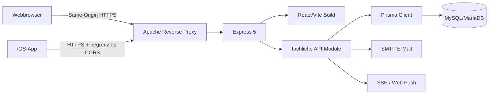
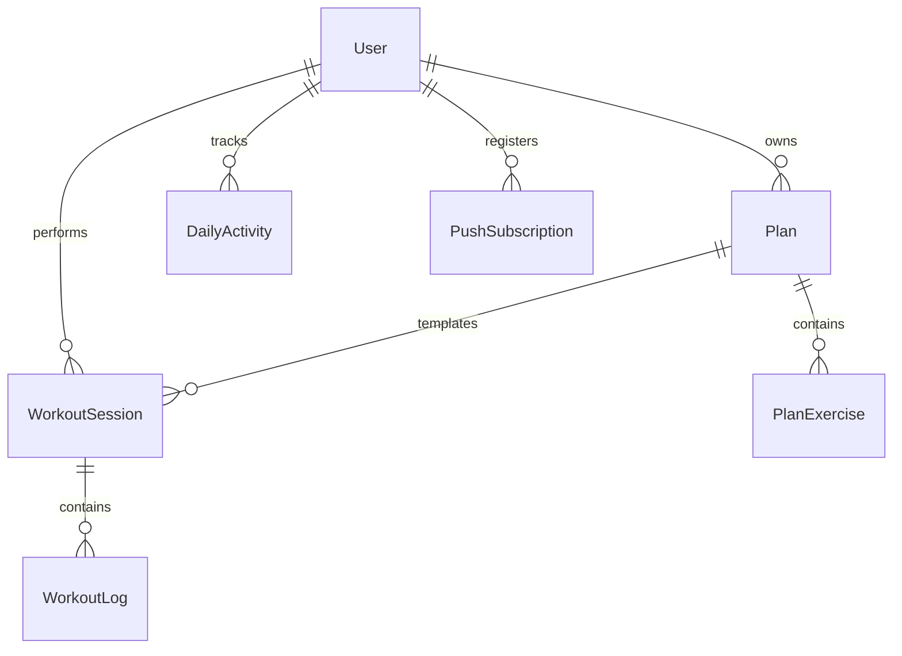

# NEXT REPS – Architekturdokumentation

**Projektteam:** Isabel Prieb und Marcel Miller

**Produkt:** NEXT REPS

**Web:** [next-reps.de](https://next-reps.de)

## 1. Ziel und aktueller Stand

NEXT REPS ist eine mobile-first Fitness-Anwendung für Workout-Planung,
Trainingstracking, tägliche Aktivität, Hydration und Fortschrittsanalyse. Die
Anwendung läuft als Website unter [next-reps.de](https://next-reps.de) und wird
mit Capacitor zusätzlich als iOS-App ausgeliefert.

### Ausgangsproblem und Produktidee

Viele Trainierende dokumentieren Pläne, Sätze und Wiederholungen in
Excel-Tabellen, Smartphone-Notizen oder Notizbüchern. Dadurch sind Daten
verstreut, Fortschritte schwer erkennbar und kommende Einheiten weiterhin
manuell zu planen. NEXT REPS verbindet diese bislang getrennten Schritte zu
einem Kreislauf aus **Planen, Trainieren, Erfassen und Analysieren**:
individuelle Pläne erstellen, Sätze und Wiederholungen loggen, Einheiten
durchführen und die Entwicklung verständlich auswerten.

### Entwicklung vom Webprodukt zur mobilen Fitnessplattform

| Phase | Entwicklung und Begründung |
| --- | --- |
| Web-MVP | Kernidee schnell, plattformunabhängig und mit realen Abläufen validieren |
| Funktionsausbau | Analytics, Tagesaktivität, Hydration und aktive Trainingsplanung ergänzen |
| Mobile App | denselben React-Client mit Capacitor als iOS-App bereitstellen |
| Wearable | Apple Health beziehungsweise Apple Watch in den persönlichen Trainingskontext einbinden |

React/Vite ermöglicht dabei eine gemeinsame Oberfläche für Web und iOS; das
Express-Backend stellt beiden Clients Pläne, Sessions und Analysen bereit. Es
handelt sich somit um zwei Zugänge zu demselben Produkt statt um getrennte
Prototypen.

### Branding, Vermarktung und Produktziel

Die visuelle Identität wurde vollständig eigenständig entwickelt:

| Schritt | Ergebnis und Gedanke |
| --- | --- |
| Recherche | Miro-Moodboard zu Sport, Energie, Fortschritt, Technologie, Typografie und Farbstimmung als strategische Entscheidungsgrundlage |
| Konzeption | Handskizzen verbinden Buchstaben, Namen und Produktaussage; Pfeile stehen für Tracking, Richtung, Wiederholung und Entwicklung |
| Iteration | mehrere formale und typografische Varianten wurden verglichen, reduziert und zum heutigen Zeichen weiterentwickelt |
| Reinzeichnung | Adobe Illustrator für skalierbare Vektoren, präzise Proportionen, Abstände und Logoanwendungen |
| Markensystem | Dark Mode, Lime-Grün, gerichtete Formen, reduzierte Typografie, Key Visuals, Bildstimmungen, Motion sowie Logo- und Sublogo-Anwendungen |
| Praxistransfer | Einsatz in Website, iOS-App, Landingpage, Instagram-Posts und Reels |

Social-Media-Posts, Schnitte und Stimmungsvorgaben prüfen, ob die Identität auch
außerhalb eines App-Screens als Marke funktioniert. Zugleich schaffen sie
Sichtbarkeit, einen emotionalen Produkteinstieg, einen zukünftigen
Feedbackkanal und die Grundlage für eine konsistente Vermarktung. Branding und
Marketing sind deshalb Bestandteil der Produktstrategie, nicht nachträgliche
Dekoration.

Das Ziel endet nicht mit der Prüfungsabgabe. Die App soll in naher Zukunft
veröffentlicht, vertrieben und mit realen Nutzern getestet werden. Feedback,
Stabilität und Verständlichkeit der Analysen sollen dabei systematisch geprüft
werden; die aktuelle Anwendung bildet den funktionsfähigen Produktkern.

### Produkt-Roadmap

Die folgenden Funktionen sind als nächste Ausbaustufen geplant und werden klar
vom bereits implementierten Umfang getrennt:

| Ausbaustufe | Geplanter Nutzen |
| --- | --- |
| Pläne teilen | Trainingspläne zwischen Nutzern freigeben sowie als PDF exportieren oder versenden |
| Trainer-Funktion | Trainer erstellen Pläne, weisen sie Sportlern zu und werten deren Durchführung und Entwicklung aus |
| KI-gestütztes Coaching | Auf Basis vorhandener Trainings- und Analysedaten Pläne vorschlagen, Entwicklungen erklären und individualisierte Hinweise geben |
| Geführte Produkttour | Neue Nutzer nach der Registrierung kontextbezogen durch zentrale Bereiche und Bedienabläufe führen |
| Update-Hinweise | Nach größeren Releases neue Funktionen kompakt erklären und direkt zur passenden Stelle führen |
| Öffentlicher Produktstart | App veröffentlichen, aktiv vermarkten und anhand realer Nutzung iterativ verbessern |

Für die KI-Funktionen gilt bewusst: Empfehlungen sollen nachvollziehbar bleiben
und vorhandene Daten nutzen, ohne medizinische Diagnosen oder professionelle
Betreuung vorzutäuschen. Vor einer Umsetzung müssen deshalb Datenschutz,
Einwilligung, Datenqualität und transparente Grenzen der Empfehlungen
architektonisch berücksichtigt werden.

Dieses Dokument ist die zentrale Dokumentation des Abgabestands. Es verbindet
die aktuelle Systemarchitektur mit den Entscheidungen aus den Studio-Sessions,
begründet verworfene Alternativen und reflektiert, was im Nachhinein anders
umgesetzt würde. Die lange README unter `workout-tracker/frontend/README.md`
bleibt als historisches Arbeitsprotokoll erhalten.

## 2. Lauffähige Anwendung

### One-Command-Start

Voraussetzungen sind Node.js 22, npm und Docker mit Docker Compose.

```bash
npm ci
npm start
```

`npm start` startet MySQL, wartet auf den Healthcheck, generiert den Prisma
Client, wendet Migrationen an und startet Backend sowie Frontend. Danach sind
Frontend und API unter `http://localhost:5173` beziehungsweise
`http://localhost:3000/api` erreichbar.

### Konfiguration

Alle lokal benötigten Werte stehen in:

- `workout-tracker/backend/.env.example`
- `workout-tracker/frontend/.env.example`

Beim ersten Start wird die lokale Backend-Konfiguration automatisch aus der
Beispieldatei erzeugt. Produktive Datenbank-, SMTP-, JWT-, VAPID- und
SSH-Secrets liegen nicht im Repository. Das GitHub-Deployment verwendet die
Secrets `HETZNER_SSH_HOST`, `HETZNER_SSH_USER` und `HETZNER_SSH_KEY`.

## 3. Aktuelle Systemarchitektur

NEXT REPS ist ein modularer Monolith. Eine Express-Anwendung stellt die API
bereit und liefert in Produktion gleichzeitig den React-Build aus. Prisma
kapselt MySQL/MariaDB. Derselbe React-Client wird mit Capacitor als iOS-App
verpackt.



### Frontend

React 19, React Router und Vite bilden die Oberfläche. `App.jsx` steuert den
Zugriff abhängig von Login, E-Mail-Verifikation und abgeschlossenem
Onboarding. `src/api.js` kapselt alle Requests. Die Website verwendet `/api`
same-origin und authentifiziert sich mit einem HttpOnly-Cookie. Die iOS-App
verwendet die produktive HTTPS-API und einen Bearer-Token.

### Backend-Module

| Kontext | Verantwortung | API |
| --- | --- | --- |
| Identity & Access | Registrierung, Login, Verifikation, Onboarding, Profil | `/api/auth` |
| Training | Pläne, Übungen, Sessions, Satz-Logs | `/api/plans`, `/api/workouts`, `/api/sessions` |
| Daily Activity | Wasser, Schritte und Tagesaktivität | `/api/daily-activity` |
| Insights & Coaching | Statistiken, Progress und Coach-Auswertung | `/api/stats`, `/api/progress`, `/api/coach` |
| Notifications | Push-Subscriptions und Benachrichtigungen | `/api/push`, `/api/events` |

`server.js` ist der Composition Root. Die Plan-Schreiblogik liegt bereits in
`training.service.js`. Weitere Service-Dateien markieren die gewünschte
Modulgrenze, enthalten aber teilweise noch nicht die gesamte Geschäftslogik.
Route-Dateien wie Identity, Sessions und Coach bleiben deshalb dokumentierte
Refactoring-Ziele.

### Datenmodell



MySQL speichert Nutzer, Pläne, Übungen, Sessions, Satz-Logs, Tagesaktivitäten
und Push-Subscriptions. `clientSessionId` macht Session-Speicherung
idempotent. Prisma-Migrationen versionieren alle Schemaänderungen.

### Authentifizierung und Sicherheit

Passwörter werden mit bcrypt gehasht. Nach erfolgreichem Login wird ein
signierter JWT ausgegeben. Webclients erhalten ihn als HttpOnly-, Secure- und
SameSite-Cookie; native Clients verwenden den Bearer-Header. Geschützte Queries
filtern zusätzlich nach der serverseitig ermittelten `userId`.

Weitere Schutzschichten:

- CSRF-Header für zustandsändernde Requests
- Auth-, Login-, Mail- und Verification-Rate-Limits
- gehashte, ablaufende und versuchslimitierte Verifikationscodes
- explizite Feld-Allowlist bei Profiländerungen
- begrenzte JSON- und Bildgrößen
- Helmet, CSP und explizit vertrauenswürdige Reverse Proxies

### Security-Review: CodeSniper V1 bis V9

Die Sicherheitsarbeit wurde nicht nur punktuell, sondern durch wiederholte
CodeSniper-Scans überprüft. Der erste Bericht V1
(`18ab13e3-d5ac-4696-a1ba-ccb149f44790`) bewertete den Stand mit 33
Code-Findings und 41 Dependency-Findings als schwach. Darunter waren fünf
High-Findings, unter anderem fehlendes Rate-Limiting, hart codierte
Zugangsdaten, unsichere Build-Abhängigkeiten und unzureichende serverseitige
Autorisierung.

Der abschließende Vergleichsbericht V9
(`9bf55ff9-f95f-4193-be9c-468c459096c0`) enthält noch fünf Code-Hinweise und
zwölf Dependency-Hinweise. Das entspricht einer Reduktion um 28 Code-Findings
und 29 Dependency-Findings. V9 bestätigt außerdem, dass keine aktiven
Produktionszugangsdaten, API-Keys oder privaten Schlüssel im Repository
gefunden wurden.

Wichtige Maßnahmen zwischen den Scans:

- serverseitige Ownership-Prüfungen und Demo-Account-Schutz
- getrennte Rate-Limits für Login, Verifikation und E-Mail-Versand
- Ablaufzeit, Versuchslimit und serverseitige Speicherung von
  Verifikationscodes
- CSRF-Headerprüfung, Helmet/CSP und sichere Redirect-Validierung
- Größenlimits für JSON und Profilbilder
- SSH-Key statt Passwort im Deployment
- gezielte Dependency-Upgrades und Overrides

Die verbliebenen V9-Hinweise werden differenziert bewertet:

- Der Medium-Hinweis zum schnellen SHA-256-Hash eines niedrig-entropischen
  sechsstelligen Codes ist ein berechtigtes Rest-Risiko. Ablaufzeit,
  Versuchslimit und Rate-Limiting begrenzen Online-Angriffe; für besseren
  Schutz bei einem Datenbankabfluss soll auf einen langsamen, gesalzenen Hash
  umgestellt werden.
- Der gemeldete unhandled Promise-Pfad beim Laden des Profilbilds besitzt im
  aktuellen Stand bereits einen `.catch()`-Zweig und wird daher als behoben
  beziehungsweise als Scanner-Fehlalarm bewertet.
- Der CSRF-Hinweis ist informational: Die Anwendung verwendet bewusst eine
  eigene Headerprüfung für alle zustandsändernden `/api`-Requests statt des
  veralteten `csurf`-Pakets.
- `Math.random()` erzeugte nur eine lokale Offline-Queue-ID und schützte keine
  Berechtigung. Der Hinweis wurde dennoch geschlossen, indem die ID nun mit
  `crypto.randomUUID()` erzeugt wird.
- Die verbleibenden Dependency-Hinweise betreffen vor allem transitive
  Entwicklungsabhängigkeiten (`@capacitor/cli`, `tar`, `@babel/core`) und
  werden unter Beachtung der geforderten Sieben-Tage-Supply-Chain-Regel
  aktualisiert.

### Deployment

Jeder Push auf `main` startet GitHub Actions. Der Workflow baut das Frontend,
kopiert es nach `backend/public`, überträgt den Monolithen per SSH/rsync zu
Hetzner, installiert Produktionsabhängigkeiten, führt Prisma-Migrationen aus
und lädt Passenger beziehungsweise den laufenden Node-Prozess neu. Apache
terminiert HTTPS und leitet an Express weiter.

## 4. Architekturentscheidungen der Studio-Sessions

Die folgenden Sessions bilden den tatsächlichen Projektverlauf ab. Frühere
Zwischenentscheidungen werden nicht nachträglich versteckt, sondern mit ihrer
späteren Änderung und den daraus gewonnenen Erkenntnissen dokumentiert.
Die Nummerierung wurde aus dem chronologischen Git-Verlauf und den vorhandenen
Studio-Abschnitten der historischen README konsolidiert.

| Session | Thema | Nachweis im Projektverlauf |
| --- | --- | --- |
| 01 | React/Vite und UI-Grundlage | `225010c`, `499e61e` |
| 02 | REST-Ressourcen und CRUD | `9895661`, `c2dff97` |
| 03 | relationale Persistenz | `9063a35`, später MySQL-Migration `9521148` |
| 04 | Prisma ORM und Migrationen | `9c48417` |
| 05 | Authentifizierung | `f63dcf1`, `03f0317` |
| 06 | Ownership und Account-Sicherheit | `03f0317`, `15a265b` |
| 07 | echte Analytics-/Aktivitätsdaten | `8a21916`, `a4a6407`, `be57f7b` |
| 08 | SSE-Echtzeitentscheidung | `1919a39` |
| 09 | modularer Monolith | README „Studio-Session 09“, `48d7dd2` bis `8e65ac3` |
| 10 | E-Mail, Push und Notification-Kanäle | `ddf78db` |
| 11 | Capacitor und native iOS-Integration | `ddf78db`, `b39dbc9` |
| 12 | Launch-Polish, Sicherheit und Deployment | README „Studio-Session 12“, `5113a1d` und folgende Security-/Landing-Commits |

### Studio-Session 01 – Frontend-Grundlage

**Entscheidung:** React mit Vite statt Next.js.

**Alternativen:** Next.js hätte serverseitiges Rendering, dateibasiertes
Routing und Full-Stack-Konventionen geliefert. Statisches HTML/JavaScript wäre
kleiner, aber für die interaktiven Dashboards schwer wartbar gewesen.

**Warum:** NEXT REPS ist primär eine eingeloggte, clientseitig interaktive App.
Vite bietet schnellen Entwicklungsstart und einen einfachen statischen Build.
Express war bereits als separates Backend vorgesehen; Next.js hätte eine
zweite Serverarchitektur und unnötige Überschneidungen eingeführt.

**Im Nachhinein:** Die Wahl bleibt passend. Früher hätte jedoch eine klare
Feature-Ordnerstruktur und eine kleinere zentrale `App.jsx` festgelegt werden
sollen. Das hätte spätere Refactors reduziert.

### Studio-Session 02 – REST-Ressourcen und API

**Entscheidung:** Ressourcenorientierte Express-API unter `/api` mit
verschachtelten Plan-Übungsrouten.

**Alternativen:** GraphQL hätte flexible Clientabfragen ermöglicht. Reine
Frontend-Mockdaten oder Local Storage wären schneller gestartet, hätten aber
keinen stabilen Mehrnutzervertrag geschaffen.

**Warum:** Pläne, Übungen, Sessions und Logs besitzen klare CRUD-Operationen.
REST ist dafür transparent, mit HTTP-Statuscodes leicht testbar und passt zum
vorhandenen Express-Stack.

**Im Nachhinein:** Der API-Vertrag hätte zu Beginn als OpenAPI-Spezifikation
festgehalten werden sollen. Einige ältere snake_case/camelCase-Übersetzungen
mussten später aus Kompatibilitätsgründen beibehalten werden.

### Studio-Session 03 – Persistenz und Datenbankwahl

**Entscheidung:** Zunächst SQLite für den schnellen lokalen Einstieg, später
Migration auf MySQL/MariaDB für Docker und Hetzner.

**Alternativen:** Local Storage oder In-Memory-Daten hätten keine
serverseitige, relationale Persistenz geboten. PostgreSQL wäre technisch
ebenfalls geeignet gewesen. Redis passt besser zu kurzlebigen Cache- oder
Queue-Daten als zu relationalen Trainingsdaten.

**Warum:** SQLite minimierte zu Beginn die Infrastruktur. Mit produktivem
Hosting, parallelem Zugriff und reproduzierbarer Docker-Entwicklung wurde
MySQL sinnvoller und war bei Hetzner direkt verfügbar.

**Im Nachhinein:** MySQL hätte von Beginn an verwendet werden sollen. Der
SQLite-zu-MySQL-Wechsel verursachte Adapter-, Pfad- und Deploymentarbeit.
Profil- und Workoutbilder sollten langfristig außerdem in Object Storage statt
als große Datenbankfelder liegen.

### Studio-Session 04 – Prisma als ORM

**Entscheidung:** Prisma statt direkter SQL-Queries.

**Alternativen:** Raw SQL hätte maximale Kontrolle und weniger Abstraktion
geboten; ein Query Builder wäre ein Mittelweg gewesen.

**Warum:** Prisma verbindet Schema, Relationen, Migrationen und typsichere
Clientgenerierung. Nested Writes und Transaktionen passen besonders zu
Workout-Plänen mit Übungen und Sessions mit Logs.

**Im Nachhinein:** Prisma war sinnvoll, aber Versions- und Adapterwechsel
hätten früher automatisiert getestet werden müssen. Eine einzige
`DATABASE_URL` muss die Quelle der Wahrheit sein; separate Adapterwerte dürfen
nur Overrides sein.

### Studio-Session 05 – Authentifizierungsstrategie

**Entscheidung:** bcrypt-Passwort-Hashes und kurzlebige JWTs; HttpOnly-Cookie
im Web, Bearer-Token in der nativen App.

**Alternativen:** Serverseitige Sessions wären leicht widerrufbar, benötigen
aber einen Session Store. Token in Browser-Local-Storage wäre einfacher, aber
bei XSS direkt auslesbar. Externe Auth-Provider hätten Aufwand abgenommen,
aber Abhängigkeit und Kosten erhöht.

**Warum:** JWT funktioniert im einzelnen Express-Prozess und mit Capacitor.
Das HttpOnly-Cookie schützt den Webtoken vor direktem JavaScript-Zugriff. Der
Bearer-Token löst die Cookie-Einschränkungen des nativen WebViews.

**Im Nachhinein:** Web- und Native-Authentifizierung hätten von Anfang an
getrennt als zwei Clients dokumentiert werden sollen. CORS und CSP für die
iOS-Origin wurden erst beim Gerätetest vollständig sichtbar.

### Studio-Session 06 – Autorisierung und Account-Sicherheit

**Entscheidung:** Jede fachliche Query wird neben der Authentifizierung durch
Ownership über `userId` geschützt. E-Mail-Änderungen verwenden `pendingEmail`
und einen eigenen Verifikationsflow.

**Alternativen:** Nur JWT-Prüfung ohne Datensatzfilter hätte IDOR ermöglicht.
Eine neue E-Mail sofort zu übernehmen wäre einfacher, könnte aber Accounts
ohne Besitznachweis umleiten.

**Warum:** Authentifizierung beantwortet nur, wer anfragt. Ownership entscheidet,
auf welche Pläne, Sessions und Profildaten diese Person zugreifen darf.

**Im Nachhinein:** Die Ownership-Regeln hätten zentral in Services statt
teilweise in Routes beginnen sollen. Sicherheits- und Missbrauchstests hätten
parallel zur ersten Auth-Version entstehen müssen.

### Studio-Session 07 – Echte Trainings- und Analytics-Daten

**Entscheidung:** Dashboard, Analytics und Coach werden aus persistierten
Sessions, Logs und DailyActivity abgeleitet statt aus statischen Mockwerten.

**Alternativen:** Vorgefertigte Demo-Kennzahlen wären visuell schneller
gewesen. Alle abgeleiteten Scores in der Datenbank zu speichern hätte Abfragen
beschleunigt, aber Synchronisationsprobleme erzeugt.

**Warum:** Trainingsfortschritt muss die tatsächlichen Nutzerdaten widerspiegeln.
Ableitung vermeidet widersprüchliche Duplikate. Demo-Werte bleiben nur dort,
wo sie ausdrücklich als Demoerlebnis benötigt werden.

**Im Nachhinein:** Berechnungen sollten früher als pure, separat getestete
Domainfunktionen aufgebaut werden. Das würde die geforderte Backend-Coverage
erleichtern und große Route-/Page-Dateien verkleinern.

### Studio-Session 08 – Echtzeitmechanismus

**Entscheidung:** Normale REST-Requests bleiben Standard; für
`plans:changed` wurde SSE als gezielte Lern- und Mehrtab-Funktion ergänzt.

**Alternativen:** Polling erzeugt regelmäßige Requests auch ohne Änderung.
WebSockets beziehungsweise Socket.io ermöglichen bidirektionale Kommunikation,
sind für eine persönliche Tracker-App ohne Chat oder kollaboratives Editing
aber überdimensioniert.

**Warum:** Das relevante Ereignis ist einseitig: Der Server signalisiert, dass
ein anderer Tab desselben Nutzers die Pläne neu laden soll. SSE ist dafür
einfach, HTTP-basiert und reconnectet automatisch.

**Im Nachhinein:** Für den aktuellen Produktumfang wäre sogar gezieltes
Refetching ausreichend. Falls SSE produktkritisch wird, braucht es eine
persistente Event-ID oder Queue, weil Events während eines Serverneustarts
nicht nachgeliefert werden.

### Studio-Session 09 – Modularer Monolith

**Entscheidung:** Fachliche Bounded Contexts innerhalb eines Deployments statt
technischer Sammelordner oder Microservices.

**Alternativen:** Ein unveränderter Monolith aus großen Route-Dateien wäre
kurzfristig einfacher. Microservices würden unabhängige Deployments erlauben,
aber Netzwerkverträge, Observability und mehrere Betriebsprozesse verlangen.

**Warum:** Das Team und der Produktumfang rechtfertigen ein Deployment, aber
Identity, Training, Daily Activity, Insights und Notifications brauchen klare
Verantwortungen. Der modulare Monolith verbindet beide Anforderungen.

**Im Nachhinein:** Die Modulgrenzen hätten vor den ersten Routen definiert
werden sollen. Aktuell liegt nur ein Teil der Training-Logik im Service Layer;
weitere Route-Logik muss schrittweise ausgelagert werden. Der Boundary-Check
ist bewusst ein erster Schutz, noch kein vollständiger Architekturtest.

### Studio-Session 10 – Notification-Kanäle

**Entscheidung:** Transactionale Verifikationsnachrichten per SMTP-E-Mail mit
React-Email-Template; In-App/SSE für unmittelbare Produktänderungen; Web Push
nur als opt-in Lernfunktion.

**Alternativen:** Alle Ereignisse per E-Mail oder Push zu melden wäre technisch
einheitlich, aber störend. Ein externer Mail-API-Anbieter wurde geprüft; für
das vorhandene Hosting wurde eine konfigurierbare SMTP-Anbindung gewählt.

**Warum:** Der Kanal folgt der Bedeutung des Events. Verifikationscodes müssen
außerhalb der App zugestellt werden. Wasser-Logs oder eigene Planänderungen
brauchen keine E-Mail. Mailfehler dürfen die bereits erfolgreiche
Registrierungsantwort nicht zerstören.

**Im Nachhinein:** Push für eigene Planänderungen ist produktfachlich kaum
nötig. Sinnvoller wären opt-in Workout- und Hydration-Reminder sowie
Sicherheitsmails bei Passwort- oder E-Mail-Änderungen.

### Studio-Session 11 – Native App mit Capacitor

**Entscheidung:** Bestehendes React-Frontend mit Capacitor als iOS-App
verpacken und HealthKit über ein natives Plugin anbinden.

**Alternativen:** Eine separate SwiftUI-App hätte die beste native Integration,
aber zwei Oberflächen und deutlich mehr Entwicklungsaufwand erzeugt. Eine PWA
ist einfacher, hat auf iOS jedoch eingeschränktere native Schnittstellen.

**Warum:** Capacitor maximiert Wiederverwendung und ermöglicht trotzdem
HealthKit, native Reminder und Xcode-Deployment.

**Im Nachhinein:** Native API-Origin, CSP/CORS, Tokenhaltung und Plugin-Patching
hätten als automatisierter Buildtest geplant werden sollen. Der reale
iPhone-Test deckte Probleme auf, die im Browser nicht auftreten.

### Studio-Session 12 – Launch, Landingpage und Deployment

**Entscheidung:** Ein einzelnes produktives Node-Deployment liefert React und
API same-origin aus; GitHub Actions deployed per SSH-Key zu Hetzner.
Die öffentliche Landingpage kommuniziert Nutzen vor Feature und verwendet
echte App-Reels statt Stockmaterial.

**Alternativen:** Getrenntes Frontend-/Backend-Hosting hätte unabhängige
Skalierung ermöglicht, aber CORS, Cookies und zwei Deployments komplizierter
gemacht. Passwort-SSH wurde aus Sicherheitsgründen durch Schlüssel ersetzt.
Eine generische Template-Landingpage wäre schneller, aber weniger glaubwürdig.

**Warum:** Same-Origin vereinfacht Authentifizierung und Betrieb. Der
Deployment-Workflow ist reproduzierbar und wendet Migrationen automatisch an.
Die Landingpage zeigt den tatsächlichen Produktworkflow und führt direkt zu
Registrierung oder Login.

**Im Nachhinein:** Der Hetzner-Restartmechanismus hätte früher mit einem
produktiven Smoke-Test abgesichert werden sollen. Medien und 3D-Demo sollten
noch stärker codegesplittet und automatisiert per Lighthouse überwacht werden.

## 5. UX und Designsprache

### Gestalterisches Ziel

Die Leitbegriffe **energetisch, modern, futuristisch und minimalistisch**
entstanden in einem längeren Recherche- und Iterationsprozess. Ein helles
Standard-Dashboard wirkte zu generisch und ist in dunkleren Trainingsräumen
unangenehmer; ein dekoratives Interface hätte dagegen von schnellen Aktionen
abgelenkt. Dark Mode schafft deshalb eine ruhige Basis, während Lime `#c5fe00`
Aktionen, Auswahl und Fortschritt mit hohem Kontrast kennzeichnet.

Gemeinsame Tokens für Farbe, Abstand, Typografie, Radien und Motion verbinden
Landingpage, Dashboard, Workouts, Logger, Analytics und Profil. Wiederkehrende
Muster stärken die Marke und reduzieren zugleich die kognitive Belastung.

### Recherche, Prototyping und Umsetzung

Pinterest-Referenzen zu Fitnessprodukten, futuristischen Interfaces, Editorial
Layouts, Sportkampagnen und Dark Mode wurden nach Typografie,
Informationsdichte, Kontrast, Bildsprache und Motion ausgewertet, nicht
unverändert übernommen.

| Phase | Vorgehen |
| --- | --- |
| Exploration | erste Richtungen und Frames mit Stitch.ai |
| Ausarbeitung | manuelle Überarbeitung und Vereinheitlichung in Figma |
| Realitätscheck | Umsetzung in VS Code/React mit echten Daten, Zuständen und responsiven Größen |
| Iteration | erneute Prüfung in Browser, Smartphone und realem Training |

Dieser Kreislauf ist nötig, weil statische Frames keine langen Namen,
Leerzustände, Ladezeiten oder Tastatureingaben zeigen. Midjourney und ChatGPT
unterstützten bei Bildern, Key Visuals und Medien; Auswahl, Zuschnitt,
Kompression, Branding-Integration und UX-Entscheidungen blieben manuelle
Arbeit.

### Eigene Bildsprache und Übungsillustrationen

Jede Übung erhält schrittweise eine eigene Lime-grüne Illustration. Die noch
unvollständige Bibliothek wird bewusst konsistent erweitert. Ein
Bodybuilding-Trainer empfahl die Galerie besonders für Einsteiger, da Namen
allein Wissen über Geräte, Bewegung und Muskelgruppen voraussetzen. Bild,
Kategorie und Name erleichtern die Einordnung.

Geplante anklickbare Detailansichten sollen Bewegung, Körperhaltung, typische
Fehler und Muskelgruppen erklären. Vor Veröffentlichung müssen diese Inhalte
fachlich geprüft werden, da falsche Hinweise Verletzungen begünstigen können.

### Nutzungstests im Fitnessstudio

Eigene Tests während realer Trainingseinheiten machten Probleme sichtbar, die
am Desktop kaum auffallen:

| Beobachtung | Konsequenz |
| --- | --- |
| Bilder und längere Einheiten gingen durch unzureichende Persistenz verloren | serverseitige Speicherung von Workouts und Logs sowie verbessertes Datenmodell |
| zu viele Eingaben verlangsamten das Training | Sätze direkt und mit wenigen Schritten abhaken |
| Gerätewerte fehlten beim nächsten Besuch | Notizen für Sitzhöhe, Griffposition und individuelle Hinweise |
| nicht jeder besitzt eine Smartwatch | optionale grobe Kalorienverbrauchsschätzung als Orientierung, nicht als exakter medizinischer Wert |

So wurde die Oberfläche wiederholt nicht nur auf Vollständigkeit, sondern auf
Geschwindigkeit und praktische Nutzung zwischen zwei Sätzen geprüft.

### Hydration, Schritte und zugängliches Tracking

Hydration kam durch die reale Nutzung hinzu: Wasser-Logging, Tagesziel und
Füllstandsanzeige machen Trinken im Tagesüberblick sichtbar. Schritte und
Aktivität können aus Apple Health beziehungsweise der Apple Watch stammen,
bleiben aber manuell erfassbar. Wearables erweitern das Produkt, sind keine
Zugangsvoraussetzung.

### Zweisprachigkeit und Lokalisierung

Ein zentraler `LanguageContext` stellt Deutsch und Englisch über gemeinsame
Übersetzungsschlüssel bereit. Da Englisch die primäre Arbeitssprache war, ist
diese Fassung aktuell konsistenter; deutsche Begriffe, Satzstellungen und
Fachübersetzungen benötigen noch einen redaktionellen Review.

Vor einem Launch ist ein eigener Localization-Review vorgesehen:

1. verbleibende fest codierte Texte in Übersetzungsschlüssel überführen,
2. Begriffe wie Workout, Satz, Wiederholung, Log und Progressive Overload
   innerhalb der gesamten App vereinheitlichen,
3. deutsche Texte nicht nur wörtlich übersetzen, sondern auf Verständlichkeit
   und verfügbare UI-Breite prüfen,
4. Datums-, Zahlen- und Einheitendarstellung sprach- beziehungsweise
   regionsabhängig formatieren,
5. beide Sprachfassungen auf kleinen mobilen Displays testen.

Deutsch unterstützt den ersten Zielmarkt, Englisch eine größere
Fitness-Community. Die Zweisprachigkeit ist damit Produkt- und
Vertriebsentscheidung, nicht nur ein Oberflächen-Extra.

### Erinnerungen und App-Mitteilungen

Reminder sollen Routinen im passenden Moment unterstützen, nicht nur Daten
nachträglich anzeigen. iOS besitzt eine native Hydration-Anbindung; Einstellungen
für Workout- und Trinkhinweise sind vorhanden. Alle Mitteilungen bleiben
Opt-in. Vor dem Launch müssen Zeitsteuerung, Zeitzonen, Ruhezeiten,
Berechtigungsdialoge und Deaktivierung geprüft werden, damit Motivation nicht
in Benachrichtigungsmüdigkeit umschlägt.

### Geführte Einführung und „Was ist neu?“

Das bestehende Onboarding sammelt Daten für Ziele und Analysen. Zum Launch soll
eine zusätzliche Produkttour zentrale Bereiche durch Umrandungen, Fokusflächen
und kurze kontextbezogene Erklärungen schrittweise vorstellen:

1. zuerst den ersten Trainingsplan auswählen oder erstellen,
2. anschließend einen Satz loggen und abhaken,
3. Notizen und Geräteeinstellungen erklären,
4. Kalender, Hydration und Analysen erst dann vorstellen, wenn sie relevant
   werden.

Progressive Offenlegung verhindert Überforderung. Die Tour muss überspringbar,
erneut aufrufbar, pro Nutzer speicherbar und responsiv sein, ohne wichtige
Bedienelemente zu verdecken.

Nach größeren Updates ist ergänzend eine kurze „Was ist neu?“-Übersicht
mit Nutzenbeschreibung und direkter Verlinkung vorgesehen. Eine
Versionskennung verhindert wiederholte Hinweise bei jedem Appstart.

### Onboarding und sensible Körperdaten

Das persönliche Onboarding bündelt Trainingsfokus, Größe, Gewicht und
Tagesziele, statt Werte später verstreut abzufragen. Der daraus ableitbare BMI
ist nur ein grober Richtwert, da er Muskelmasse, Körperzusammensetzung, Alter
und individuelle Gesundheit unzureichend berücksichtigt. Eine Testperson
empfand die prominente Anzeige zudem als triggernd. Der Wert wird deshalb
erklärt und kann ausgeblendet werden. Personalisierung bedeutet somit nicht nur
mehr Daten, sondern Kontrolle über deren Sichtbarkeit.

### Motion Design als funktionaler Bestandteil

Motion gibt direktes Feedback, macht den reduzierten Dark Mode lebendiger und
Fortschritt emotional wahrnehmbar:

- die steigende Wasseranimation beim Hydration-Tracking,
- Konfetti bei neuen Meilensteinen,
- sich füllende Fortschrittsanzeigen und Diagramme,
- Übergänge beim Öffnen, Speichern und Wechseln von Zuständen,
- die scrollgesteuerte Smartphone-Inszenierung auf der Landingpage.

Animationen bleiben kurz, zielgerichtet und konsistent, damit sie motivieren,
ohne das Training zu verlangsamen. `prefers-reduced-motion` und automatisierte
Accessibility-Tests sind noch vollständiger umzusetzen.

### Kalender und nachträgliches Logging

Der Kalender kam hinzu, als neben einzelnen Plänen auch deren zeitliche
Einordnung wichtig wurde. Mehrere Entwürfe wurden über Wochen vereinfacht.
Web und Mobil folgen demselben Modell; mobil bleibt die Wochenansicht kompakt
und lässt sich zum Monat erweitern.

Zunächst waren nur zukünftige Trainings planbar. Eine durch frühe
Persistenzprobleme verlorene Einheit zeigte, dass auch Nachtragen und späteres
Öffnen nötig sind. Der Kalender wurde dadurch vom Planer zum persönlichen
Trainingsarchiv.

### Vorgefertigte Pläne für Einsteiger

Ein leerer Builder kann Anfänger überfordern. Vorgefertigte Pläne zeigen einen
strukturierten Startpunkt und bleiben anpassbar. Langfristig soll KI Vorschläge
nach Ziel, Erfahrung, Zeit und Ausstattung personalisieren. Bis Regeln für
sichere, nachvollziehbare und fachlich geprüfte Empfehlungen bestehen, bleibt
die kontrollierbare Vorlagenlogik Grundlage.

### Entwicklung der Analysen

Anfangs zeigten die Analysen nur einfache Werte wie das höchste Gewicht. Tests
machten deutlich, dass ein Rekord Konsistenz, Volumen und Entwicklung kaum
abbildet. Daraus entstanden vier Leitfragen: Wie lange wird wöchentlich
trainiert, welche Übungen dominieren, wie entwickeln sich Häufigkeit und
Volumen und steigt die Leistung gegenüber früheren Einheiten?

Die Bubble-Ansicht übersetzt Häufigkeit in Größe; der
Progressive-Overload-Score vergleicht die aktuellen mit den vorherigen 30
Tagen. Weil eine weitere Testrunde zeigte, dass Nutzer attraktive Diagramme
ohne Kontext nicht sicher interpretieren, wurden die Widgets klickbar.
Pop-ups erklären Berechnung, Relevanz und Auswertung. Visualisierung dient
damit nicht nur der Ästhetik, sondern nachvollziehbaren Entscheidungen.

### Landingpage: Nutzen vor Feature

Als erster Kontakt muss die Landingpage zugleich Aufmerksamkeit erzeugen und
NEXT REPS erklären. Eine reine Kampagnenseite würde das Problem verschleiern,
eine Featureliste die Energie der Marke verlieren. Deshalb verbinden wir
Inszenierung, echten Produktbeweis und Information: Headline, Subtext und CTA
klären im ersten Viewport Produkt, Nutzen und Einstieg; Hero-Reels zeigen
Planung, Tracking und Analytics statt bloßer Versprechen.

Animationen vermitteln Modernität und Nutzungsfreude, bleiben aber dosiert,
damit Text und CTA Vorrang behalten. Ruhige Informationsflächen wechseln sich
mit visuellen Höhepunkten ab. Besucher sollen erst aufmerksam werden und dann
Produktumfang und nächsten Schritt verstehen.

Die Landingpage erfüllt „Nutzen vor Feature“ konkret durch:

- direkte Nutzenheadline und erklärenden Subtext
- primären CTA zur Registrierung beziehungsweise zum Dashboard
- direkten Login für bestehende Nutzer
- Hero-Reels als früher visueller Beweis des Produktworkflows
- scrollgesteuerte Smartphone-Demo als animiertes 3D-Mockup und Sneak Peek der
  mobilen Anwendung
- Produktvorschauen und Diagramme statt generischer Referenzbilder
- drehendes Sublogo als wiederkehrendes Markenelement
- animierte Pfeile und Key Visuals in der NEXT-REPS-Formsprache
- Q&A-Bereich für häufige Fragen und mögliche Einstiegshürden
- responsive Breakpoints und semantische Buttons/Links

Das vorhandene Q&A wird vor dem Launch anhand echter Fragen zu Kosten,
Datenschutz, Apple Watch, Training ohne Wearable, Datenexport, Zielgruppen und
Analysequalität erweitert. So reduziert die Seite Unsicherheit und ermöglicht
eine informierte Registrierung, statt lediglich zu „catchen“.

### Rechtliche und organisatorische Learnings

Fiktive Platzhalter im anfänglichen Impressum führten im produktiven
Hostingkontext zu einem Hinweis beziehungsweise einer Verwarnung und wurden
korrigiert. Das Learning: Impressum, Datenschutz und Verantwortlichkeit sind
keine nachgelagerten Designinhalte, sondern müssen vor Veröffentlichung real
und geprüft vorliegen.

### Offene Design- und UX-Arbeiten

- Übungsillustrationen und fachlich geprüfte Detailansichten vervollständigen
- `prefers-reduced-motion` konsequent für alle größeren Animationen umsetzen
- Accessibility automatisiert mit axe und zusätzlich manuell prüfen
- Kalender und schnelle Satzeingabe weiter mit realen Nutzern testen
- große Video- und 3D-Chunks weiter aufteilen und komprimieren
- Körper- und Leistungskennzahlen noch granularer ein-/ausblendbar machen
- deutsche Lokalisierung redaktionell und auf allen Displaygrößen prüfen
- geführte Produkttour und versionsabhängige Update-Hinweise entwickeln
- Q&A anhand realer Fragen vor dem Launch vervollständigen
- Reminder-Zeiten, Opt-in und Benachrichtigungsfrequenz mit Nutzern testen

Große Video-/3D-Chunks erzeugen aktuell noch eine Build-Warnung. Lazy Loading
reduziert die Erstlast; weitere Aufteilung und Medienkompression bleiben ein
konkretes Performanceziel.

## 6. Funktions- und Qualitätsnachweis

### Kritische Pfade

1. Registrierung, Login, Session-Wiederherstellung und Logout
2. E-Mail-Verifikation inklusive ungültiger und abgelaufener Codes
3. persönliches Onboarding
4. Workout-Plan und Übungen erstellen
5. Training mit Satz-Logs speichern
6. Analytics und Fortschritt aus gespeicherten Sessions
7. Daily Activity und Wasseraufnahme
8. Profil- und Accountänderungen
9. Schutz nicht authentifizierter und fremder Ressourcen
10. nativer iOS-Login gegen die produktive API

### Ausgeführter Smoke-Test vom 29. Juli 2026

| Test | Ergebnis |
| --- | --- |
| geschützte Route ohne Login | erwartetes `401` |
| schwaches Registrierungspasswort | erwartetes `400` |
| gültige Registrierung und `/auth/me` | bestanden |
| falscher und gültiger Verifikationscode | bestanden |
| ungültiges und gültiges Onboarding | bestanden |
| Plan inklusive Übung speichern | bestanden |
| Session inklusive Satz-Log speichern | bestanden |
| Wasseraufnahme aktualisieren | bestanden |
| Analytics-Statistik abrufen | bestanden |
| Logout und anschließender Zugriffsschutz | bestanden |
| produktive Landingpage | `200` |
| iOS-Build und produktiver Login | bestanden |

Zusätzlich bestehen Produktionsbuild, Backend-Syntaxprüfung und
Modulgrenzen. ESLint meldet null Fehler und 28 sichtbare
React-Refactoringwarnungen.

## 7. Gesamtretrospektive

Die wichtigste Erkenntnis ist, Architekturentscheidungen früher als
überprüfbare Verträge festzuhalten. Datenbank, Auth-Clientvarianten,
Modulgrenzen und Deployment-Restart hätten zu Projektbeginn zusammen mit
automatisierten Tests definiert werden sollen. Dadurch wären mehrere spätere
Stabilisierungsschleifen vermieden worden.

Bei einem Neustart des Projekts würden wir:

1. MySQL und Docker von Beginn an verwenden.
2. API und Datenmodell zuerst als Vertrag dokumentieren.
3. Module und Services vor großen Route-Dateien anlegen.
4. Web- und Native-Auth von Beginn an getrennt testen.
5. Vitest und Cypress parallel zu den Features aufbauen.
6. Medienbudgets und Lighthouse-Messungen in CI aufnehmen.
7. Object Storage für Bilder vorsehen.

Beibehalten würden wir React/Vite, Express, Prisma, den modularen Monolithen,
Same-Origin-Webdeployment und den nutzenorientierten Produktauftritt. Diese
Entscheidungen passen weiterhin zu Teamgröße und Produktumfang.

## 8. Tests und Abgabestatus

### Backend: Vitest und Coverage

Der Backend-Testlauf startet mit einem einzigen Root-Befehl:

```bash
npm run test:backend
```

Der Befehl startet beziehungsweise prüft MySQL über Docker Compose, generiert
den Prisma Client, wendet Migrationen an und führt anschließend Vitest mit
V8-Coverage aus. Die Integrationstests verwenden einen eindeutig benannten
Testaccount, testen ausschließlich dessen Daten und löschen ihn danach wieder.

Stand vom 29. Juli 2026:

| Kennzahl | Ergebnis | Schwelle |
| --- | ---: | ---: |
| Testdateien | 6 bestanden | – |
| Tests | 42 bestanden | – |
| Statements | 80,32 % | 80 % |
| Lines | 83,49 % | 80 % |
| Functions | 89,09 % | 80 % |
| Branches | 63,34 % | informativ |

Getestet werden nicht nur Happy Paths, sondern unter anderem schwache
Passwörter, falsche Login- und Verifikationsdaten, ungültiges Onboarding,
CSRF/CORS, Mass Assignment, Ownership, ungültige Aktivitätswerte,
idempotente Session-Speicherung, SSE-Disconnects und abgelaufene
Push-Subscriptions. Feste Vitest-Schwellen für Statements, Lines und Functions
verhindern, dass die geforderte Coverage später unbemerkt unterschritten wird.

Der reproduzierbare HTML-Report liegt unter
`workout-tracker/backend/coverage/index.html`; die maschinenlesbare
Zusammenfassung liegt daneben als `coverage-summary.json`.

### Frontend: Cypress-E2E-Tests

Die Cypress-Suite startet mit `npm run test:e2e` automatisch den vollständigen
lokalen Stack aus Docker-MySQL, Prisma, Express und Vite. Sie bildet drei
kritische User-Pfade im Browser ab:

1. Registrierung, E-Mail-Verifizierung, zweistufiges Onboarding und Weiterleitung
   zum Dashboard,
2. Login, Aufruf der Account-Einstellungen und Logout,
3. Erstellung eines individuellen Workoutplans, Speicherung über das Backend
   und erneuter Nachweis des Plans nach einem Browser-Reload.

Die Tests verwenden stabile `data-cy`-Selektoren nur an kritischen
Bedienelementen. Temporäre Accounts enden auf `@example.test`; Datenbank-Tasks
akzeptieren ausschließlich diese Domain und löschen die Testdaten nach dem
Lauf. Der echte SMTP- und Push-Versand ist während E2E-Läufen deaktiviert. So
bleibt der Test realistisch, reproduzierbar und ohne Auswirkungen auf echte
Nutzer oder externe Dienste.

Stand vom 29. Juli 2026: **1 Spec-Datei, 3 Tests, 3 bestanden**.

### Gesamter Testlauf mit einem Befehl

```bash
npm test
```

Dieser Root-Befehl führt zuerst die 42 Backend-Tests samt Coverage-Report und
anschließend alle Cypress-E2E-Pfade aus. Voraussetzung ist lediglich ein
laufendes Docker Desktop; alle weiteren Dienste, Migrationen und Testschritte
werden automatisch gestartet.
