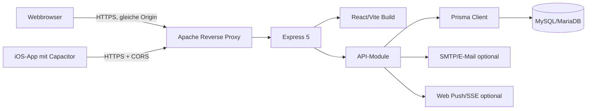
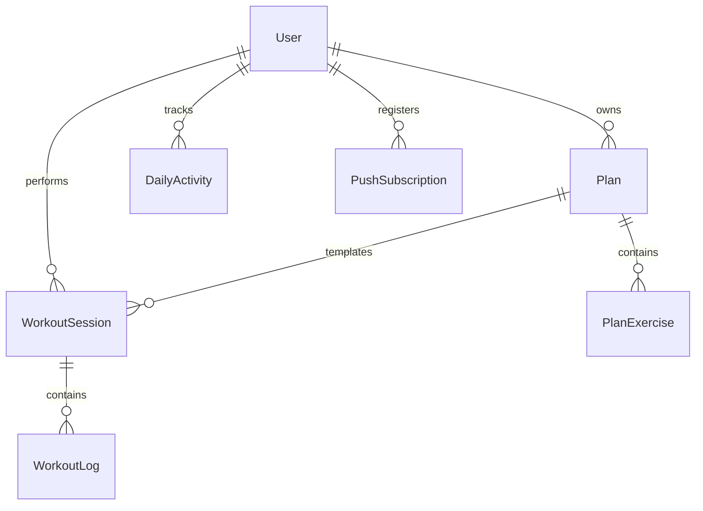
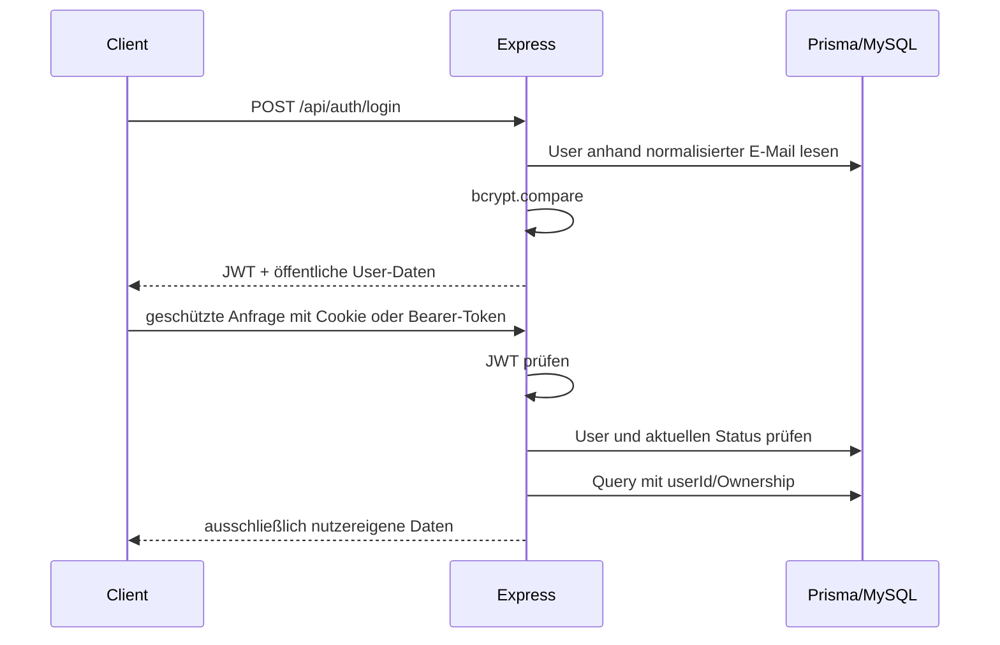
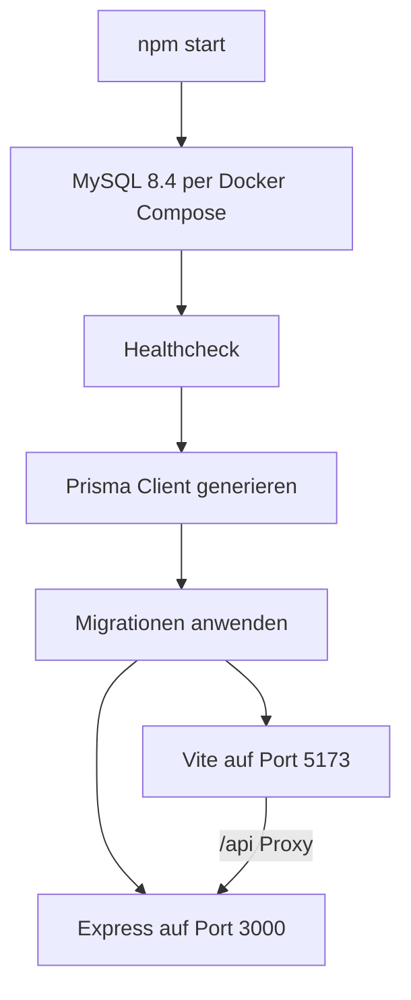

# Architektur von NEXT REPS

## 1. Systemüberblick

NEXT REPS ist als modularer Monolith umgesetzt. Eine Express-Anwendung stellt
die JSON-API bereit und liefert in Produktion gleichzeitig den gebauten
React-Client aus. MySQL/MariaDB speichert die fachlichen Daten; Prisma bildet
Schema, Migrationen und Datenzugriffe ab. Derselbe React-Client wird mit
Capacitor zusätzlich als iOS-App verpackt.

Die produktive Website und API teilen sich `https://next-reps.de`. Dadurch
bleibt die Webanwendung same-origin. Nur die installierte App benötigt eine
explizite, auf Capacitor-Origins beschränkte CORS-Freigabe.

## 2. Repository und Laufzeitkomponenten

| Bereich | Verantwortung |
| --- | --- |
| `workout-tracker/frontend/src` | React-Oberfläche, Routing, API-Client und gerätespezifische Integrationen |
| `workout-tracker/frontend/ios` | natives Capacitor-/Xcode-Projekt |
| `workout-tracker/backend/server.js` | Composition Root, Middleware-Reihenfolge, Router-Mounts und SPA-Auslieferung |
| `workout-tracker/backend/modules` | fachliche Backend-Module |
| `workout-tracker/backend/middleware` | Authentifizierung und Rate Limits |
| `workout-tracker/backend/prisma` | Datenmodell und versionierte Migrationen |
| `scripts/dev.mjs` | reproduzierbarer lokaler One-Command-Start |
| `.github/workflows/deploy.yml` | Build und Deployment auf Hetzner |

## 3. Frontend

Das Frontend nutzt React 19, React Router und Vite. `App.jsx` bildet den
zentralen Navigations- und Zugriffskontrollfluss:

1. Webnutzer sehen auf `/` die öffentliche Landingpage.
2. Die native App zeigt beim ersten Start ihr Geräte-Onboarding.
3. Nicht eingeloggte Nutzer werden zu Login oder Registrierung geführt.
4. Unverifizierte Nutzer bleiben im Verifikationsflow.
5. Verifizierte Nutzer ohne Profil-Onboarding bleiben im Onboarding.
6. Erst danach werden Dashboard und fachliche Seiten freigegeben.

`src/api.js` kapselt alle Serveraufrufe. Im Browser wird `/api` same-origin
angesprochen. Die iOS-App nutzt standardmäßig `https://next-reps.de/api` und
sendet den JWT als Bearer-Token. Webbrowser authentifizieren sich über ein
HttpOnly-Cookie.

Wichtige Oberflächenbereiche:

- Landingpage und Authentifizierung
- Dashboard und tägliche Aktivität
- Workout-Planung und Workout Logger
- Analytics, Progress und Coach
- Profil, Einstellungen und Benachrichtigungen

## 4. Backend und fachliche Module

Express ist ein modularer Monolith mit folgenden Bounded Contexts:

| Modul | Verantwortung | API-Präfix |
| --- | --- | --- |
| `identity-access` | Registrierung, Login, Verifikation, Onboarding und Profil | `/api/auth` |
| `training` | Pläne, Übungen, Sessions und Logs | `/api/plans`, `/api/workouts`, `/api/sessions` |
| `daily-activity` | Wasser, Schritte und Tagesaktivität | `/api/daily-activity` |
| `insights-coaching` | Statistik, Fortschritt und Coach-Auswertung | `/api/stats`, `/api/progress`, `/api/coach` |
| `notifications` | Push-Subscription und Public Key | `/api/push` |
| `events.js` | nutzerspezifische Server-Sent Events | `/api/events` |

`server.js` ist der Composition Root und montiert die Module. Fachliche
Operationen der Workout-Planung liegen bereits in `training.service.js`.
Andere Module besitzen vorbereitete Service-Grenzen, enthalten aktuell jedoch
noch einen Teil ihrer Geschäftslogik direkt in den Route-Dateien. Der
Boundary-Check verhindert Cross-Context-Prisma-Zugriffe in Service-Dateien;
die weitere Verschlankung der Routen ist eine bekannte Refactoring-Aufgabe.

## 5. Datenmodell

| Modell | Zweck |
| --- | --- |
| `User` | Zugangsdaten, Verifikationsstatus, Onboarding und Profil |
| `Plan` | nutzereigener Workout-Plan |
| `PlanExercise` | Zielübung eines Plans |
| `WorkoutSession` | durchgeführtes Training mit Metadaten |
| `WorkoutLog` | einzelner protokollierter Satz |
| `DailyActivity` | Tageswerte mit eindeutigem Schlüssel aus Nutzer und Datum |
| `PushSubscription` | Web-Push-Ziel eines Nutzers |

Fremdschlüssel verwenden je nach fachlicher Bedeutung `Cascade` oder
`SetNull`. `clientSessionId` verhindert doppelte Session-Speicherung bei
wiederholten Client-Anfragen. Prisma-Migrationen versionieren alle
Schemaänderungen und werden lokal wie produktiv vor dem Start angewendet.

## 6. Authentifizierung und Sicherheit

Wichtige Schutzschichten:

- Passwort-Hashes mit bcrypt
- signierte JWTs und HttpOnly-/Secure-Cookie im Web
- Bearer-Token für den nativen Client
- CSRF-Header auf zustandsändernden API-Aufrufen
- Rate Limits auf Auth-, Login-, Mail- und Verifikationsoperationen
- Verifikationscodes nur gehasht, zeitlich begrenzt und versuchslimitiert
- explizite Eingabefelder statt ungefilterter Massenzuweisung
- Ownership-Filter auf nutzerspezifischen Datensätzen
- Helmet, CSP, begrenzte JSON-Größe und explizit vertrauenswürdige Proxies

## 7. Lokale Ausführung

`npm start` orchestriert den lokalen Entwicklungsbetrieb:

Die Datenbank liegt in einem Docker-Volume und bleibt über Neustarts erhalten.
Konfiguration und Voraussetzungen stehen in der Root-README und den beiden
`.env.example`-Dateien.

## 8. Produktionsdeployment

Ein Push auf `main` startet GitHub Actions:

1. Repository auschecken und Node.js 22 einrichten.
2. Frontend reproduzierbar mit `npm ci` bauen.
3. `dist` nach `backend/public` kopieren.
4. SSH-Key aus GitHub Secrets laden und Host-Key erfassen.
5. Backend inklusive statischer Assets per `rsync` übertragen.
6. Produktionsabhängigkeiten auf Hetzner installieren.
7. Prisma-Migrationen anwenden und Client generieren.
8. Passenger beziehungsweise den vorhandenen Prozess neu laden.

Apache terminiert HTTPS und leitet Anfragen an die Node.js-Anwendung weiter.
Express liefert zuerst `/api`, danach statische Assets und zuletzt den
SPA-Fallback aus. `.env`, `node_modules` und Git-Daten werden nicht übertragen.

## 9. Querschnittliche Qualitätsregeln

- Eingaben werden an der API-Grenze normalisiert und validiert.
- API-Fehler werden als JSON mit passenden HTTP-Statuscodes ausgegeben.
- Frontend und Backend verwenden eine gemeinsame, versionierte API-Struktur.
- Modulgrenzen werden mit `npm run --workspace workout-tracker/backend
  check:modules` geprüft.
- Build-, Funktions- und Qualitätsnachweise stehen in
  `docs/QUALITY_ASSURANCE.md`.

Dieses Dokument beschreibt den aktuellen Abgabestand. Die lange README im
Frontend dokumentiert zusätzlich den historischen Lern- und
Entwicklungsprozess und kann deshalb frühere Zwischenstände erwähnen.

